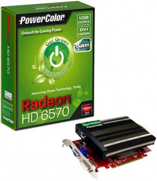

 Столкнулся с проблемой: после обновления видеокарты в компьютере(на Radeon РВ6570) оказалось, что родные драйвера не поддерживают ее: по экрану стали бегать полосочки, изображение дергалось , т.д. Установка драйвера с сайта производителя решила проблему. Несколько простых шагов как это сделать:

1) Скачиваем сам драйвер [с офсайта](https://support.amd.com/us/gpudownload/Pages/index.aspx "radeon driver") 2) Если **ранее уже был установлен** какой-то старый драйвер, то сначала удалим его выполнив команду sudo sh /usr/share/ati/fglrx-uninstall.sh и **перезапустим систему**. 3) Установим скачаный драйвер командой `sudo sh ./amd-driver-installer-12-1-x86.x86_64.run`. Скрестим пальцы и перезапустим компьютер.
