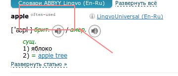

Цитирую письмо в [ABBYY](https://www.abbyy.com/).

...приветствие, введение и прочая лишняя информация вырезана...

**Суть:** добавить частотный индекс для каждого слова. **Описание:** слова в языке используются неравномерно: какие-то - редко, какие-то - часто. Переводя слово, мы изначально не знаем на сколько оно часто используется. Ответ нам даст частотный индекс слова. Он может быть как значением(например **1107**), так и просто словом-характеристикой (**often-used**). Пример:  **Смысл:** Многие используют Lingvo при изучении иностранных языков. Я в данный момент читаю книгу в оригинале и веду свой словарик, слов незнакомых оказывается много. Да, я смотрю перевод каждого - тут все хорошо. Но дальше возникает вопрос - записать ли слово в свой словарь на изучение или нет. Ведь если выписывать все слова - это будет не эффективно.

Письмо с предложением было отравлено в Lingvo.

Ответили довольно оперативно.

_Степан, добрый день._ _Спасибо за предложение! Учтем при планировании будущих релизов._ _С уважением,_ _Татьяна Парфентьева_

Видимо так отвечают всем. Ну что, будем надеяться что письмо дойдет до того, кто сможет оценить идею, а главное, у кого будет возможность ее реализовать.
