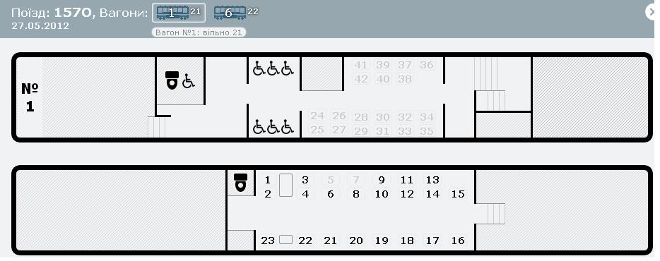
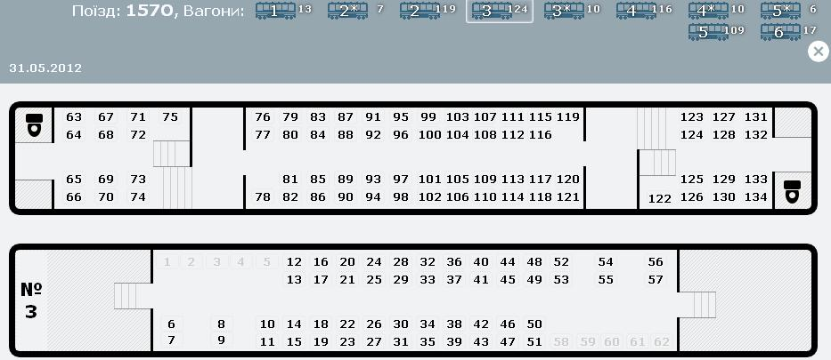
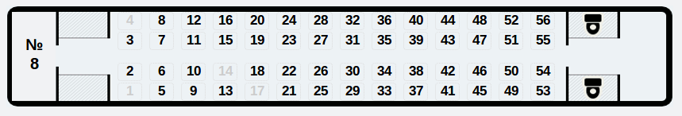
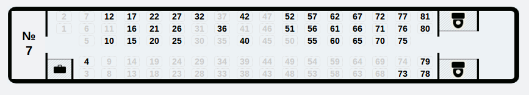

Делаю репост полезной информации по новому поезду.

**Вагоны 1 и 6 (головные):**

**2 этаж** (места с 1 по 23 по схеме 2+1) - **1 класс** Места с 1 по 15 – двуместные (два кресла рядом). Места 1-4 – со столиком. Места с 16 по 23 – одноместные (без «соседа»). Места 22 и 23 – друг напротив друга и со столиком.

**1 этаж - 2 класс** (места с 24 по 42 по схеме 2+2) места 24, 25, 26, 27 в 1 вагоне – для проводников места 43, 44, 45, 46 в 1 и 6 вагонах - для инвалидов-колясочников

**6 [вагон](https://scbist.com/wiki/7710-vagon.html) – штабной.** 

**Вагоны 2, 3, 4:**

**2 этаж-2 класс:** места с 1 по 62 - по схеме 2+2, без подлокотников между сидениями. Места 1, 2, 3, 4, 5 и 58, 59, 60, 61, 62 - "не фирменные", спиной к окну, простые.

**1 этаж-2 класс:** перед лестницей на второй этаж с одной стороны и с другой такие места: Места 63-75 и 122-134. Места 75 и 122 – одноместные (без «соседа»).

**1 этаж-2 класс:** в центре вагона (основные места) Места 76-121 по схеме 2+2. Места 78 и 119 – одноместные (без «соседа»).

В **вагоне № 5** находится **буфет**. Места на 1 и 2 этажах такие же, как и в вагонах 2, 3, 4. Места 63, 64 - для работников буфета. В вагоне нет мест 122-134 (их занимает буфет).

**Нумерация вагонов**

**_с головы поезда_**

Харьков – Донецк, Донецк - Харьков, Донецк - Мариуполь, Харьков - Днепропетровск, Днепропетровск - Харьков, Донецк - Луганск

**_с хвоста поезда_**

Донецк - Днепропетровск, Днепропетровск - Донецк, Мариуполь - Донецк, Луганск - Донецк

**Номера поездов:**

№ 157/158 Харьков-Донецк № 159/160 Харьков-Днепропетровск № 169/170 Донецк-Днепропетровск № 171/172 Донецк-Луганск № 175/176 Донецк-Мариуполь

Так же на booking.uz.gov.ua появилась нормальная **Схема нумерации мест в поезде Хюндай!**

1 класс, вагоны 2,5,8 (**\*обновлено**)

2 класс, вагоны 1,3,4,6,7,9 ( **\* обновлено** )

Взято от [сюда](https://scbist.com/vysokoskorostnoe-dvizhenie/16540-shema-numeracii-vagonov-poezdov-shkoda.html#post98962 "схема поездов") . Спасибо Игорю.

**UPD**: Самая важная информация:

WIFI: есть, но рабочие роутеры не в каждом вагоне, так что скорость оставляет желать лучшего.

Розетки: в первом классе - каждому по розетке, во втором классе - замечено не было(если что - скорректируйте пожалуйста). UPD(по пока еще не проверенной информации): _Во втором классе по две розетки через каждый ряд, с обоих сторон._

**UPD2**:  !Внимание схемы обновлены, спасибо Dmitry за выявление расхождения с новой нумерацией мест.
