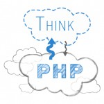

**ThinkPHP#2** или подумаем о PHP еще раз. Хотя (просматривая темы докладов), думать-обсуждать в этот раз мы похоже PHP не будем, будем думать о JavaScript, что тоже хорошо.

Итак посмотрим что у нас есть по докладам:

1\. **Управление кодом в JavaScript**. - из описания следует что это очень общая и пафосная тема. Трудно представить что реально там будет.  Ставлю **7 балов** из 10 по шкале интересности.

2\. **Безопасность веб приложений**. - Ну тут вообще капец какая общая тема, даже после описания тема не стала уже. Хоть бы пару тезисов. А так судя по всему просто по верхам пройдемся. **4 бала**

3\. **Введение в MVVM на примере Knockout для JavaScript разработчиков.** - Вот это пожалуй самая интересная тема, по крайней мере самая четкая: MVVM подход и Knockout. При хорошем изложении материала может быть очень полезно. Ставлю на хорошего докладчика **9 балов**.

Линк на регистрацию https://thinkphp.com.ua/think-two.html
