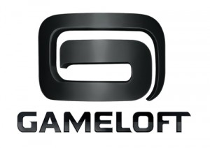
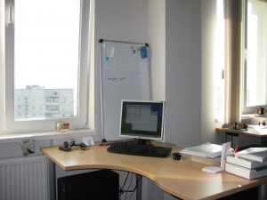
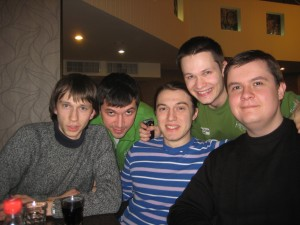
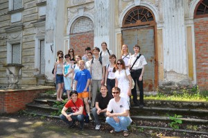
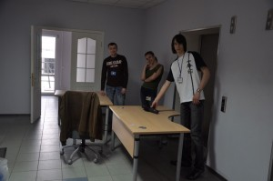

Моя первая компания; компания, в которой я на данный момент проработал больше всего. Пережив 3 поколения логотипа, думаю я смогу рассказать, что реально происходит "на кухне".

Пришел в **gameloft** в ноябре 2007 года по приглашению HRa, Евгения Биренбаума, который нашел меня на Ярмарке Вакансий (уже ежегодно проводимом событии в ХНУРЕ). Мне на тот момент поднадоело фрилансить и пришло время искать компанию для постоянной работы. Очень хорошо что на стенде аббревиатура "PHP" была нарисована крупно, иначе прошел бы мимо: даже не думал что в эту компанию нужны PHP разработчики, так как знал что компания специализируется на разработке игр для мобильных телефонов.

Inside, **первые впечатления**: современный офисный центр, все очень аккуратно и светло. Послушал историю о компании(думаю тут ее не имеет смысла пересказывать). Мне предложили 2 вакансии для **PHP** разработчика в разные отделы: **eCommerce** (отдел электронной коммерции, продажи игр ) и **WebTools** (отдел разработки внутренних инструментов). Узнав то, что eCommerce отдел развивается очень быстрыми темпами, а в WebTools пока только 2 человека и нужен был 3тий, решил писать тест в отдел электронной коммерции.

Надеюсь что за 4 года уже переработали **тест**, на тот момент он мне показался очень унылым. Состоял из 5 секций: якобы от простого к сложному. В первой секции нужно было ответить да\\нет (true\\false) на утверждение. Во второй - выбрать один из вариантов. В третей - немного написать, по типу "название функции, которая...". Четвертая секция была посвящена запросам к базе данных, тут тоже ничего сложного. Пятая - полный маразм: какой-то говнокод на 3 или 4 листа и вопрос "Что делает этот код?": там по сути код ничего не делал, просто было описание класса. На последнюю секцию я по-моему вообще забил. Но все равно, где-то через неделю пригласили на **собеседование**. Его проводил довольно толковый разработчик Иван Щербаков - первый техлид харьковской студии геймлофта. Никаких особо заумных вопросов не было, все четко и по сути. Был один вопрос с подвохом, на который я ответил, правда не сразу: на понимание сравнения возвращаемого функцией _strpos_ значения с нулем.

За это время я также успел пройти в компанию **ProgramAce**, где мне уже сделали предложение. Ответа из gameloft долго не было. Я уже позвонил в ProgramAce с сказал что согласен на их предложение. Забавно, после чего начал тормозить ProgramAce, и... ...барабанная дробь... проснулись представители gameloft с предложением. Когда же очнулись люди из ProgramAce я был успешно трудоустроен. Делайте вывод господа HR'ы: кто быстрее реагирует - тому и достаются разработчики.

**Первый рабочий день.** Что я вижу: офис варианта openspace, качественная мебель([стул](https://www.narbutas.com/products/chairs/task-chairs/aura-task/ "narbutas"), который у меня был, до сих пор считаю лучшим), приятное расположение столов: нет четкой геометрии, чтобы сэкономить место; столы стоят далеко друг от друга; не направлены в стенку.

**Первые две недели**(или около того). Из-за того что процесс подготовки кадров еще не был поставлен на конвейер и возможно потому что с одновременно с нами удаленно тренинг должны были проходить разработчики из Индии, мы ждали, когда соберется вся группа, и, откровенно говоря, плевали в потолок. За это время, от нечего делать,  мы с другом почти разработали клиент-серверный протокол шифрования трафика используя алгорим AES Rijndael.

**Первые несколько месяцев** работы в компании. После прохождения тренинга, который по своей сути заключался в разборе различных внутренних инструментов, нас распределили по командам. Я довольно хорошо выполнил заключительное задание тренинга и попал в самую сильную на тот момент команду, занимающуюся сайтами Франции. Моим непосредственным начальником стал менеджер из Румынии. Да, вот такая интересная специфика работы в интернациональной компании: задание определяли французы, распределяли - румыны, делали мы, тестировали вьетнамцы, администрировали канадцы.  В дальнейшем, когда харьковскую студию доукомплектовали менеджерами я стал работать под руководством локального менеджера Дениса Сидоренко. Крайне рад что нам посчастливилось поработать вместе: от него я получил множество полезных навыков в плане управления рабочим процессом. Так же хочется отметить Сергея Бойко, который стал отличным техническим наставником, именно его опыт вдохновлял меня на развитие и изучение нового в области PHP/MySQL.

Подошел к концу **испытательный срок** и о тут был такой тонкий момент. Стоит отметить Женю Биренбаума(HR компании), как блестящего психолога: тогда, рисуя разные цифры на листике, он четко заложил мне в голову следующую мысль: если я хорошо покажу себя на испытательном сроке - то ЗП может быть чуть ли не в полтора раза больше. Я действительно старался, начальник был мной доволен:  работал быстрее румын из его команды и намного качественнее индусов. И пройдя испытательный срок, меня конечно удивило что никакого резкого повышения зарплаты не было. Поделился своими мыслями с Женей, видимо они были очень негативно выражены, или просто ему не понравились, в любом случае он очень культурно сказал фразу, которая значила "иди гуляй, я ничего не обещал", и похоже после этого вычеркнул меня из своих друзей в компании и мне это аукнулось еще не раз.

Наш отдел, как и обещали, расширялся "не по дням, а по часам". Загруженность по прежнему остается небольшой, что позволяет заниматься английским, французским (который кстати тоже был за счет компании ), фрилансом или просто своими делами. Мы еще помню организовали что-то типа кружка самодеятельности и готовили песни под гитару именинникам.

<iframe src="https://www.youtube.com/embed/i0r8JP5uR8U" frameborder="0" width="420" height="315"></iframe>

Должен отметить сплоченный коллектив, семейную атмосферу, где все знали друг друга не только по работе, но были друзьями за пределами офиса. Со многими я до сих пор общаюсь и рад встрече.

Что было приятно, что компания поддерживала все инициативы по тимбилдингу: кроме стандартных корпоративов, был еще футбол, пеинтбол, коньки, покер, велосипеды, походы, туристические поездки и регулярные Midnight'ы ( определение пришло непосредственно из gameloft ) - это совместные походы в кинотеатр, театр и другие события, куда закупались организовано билеты.

За это время у меня и мысли не возникало, чтобы уйти куда-то работать в другую компанию, при том, что на меня выходили HR'ы IT компаний и пытались переманить к себе.

**Второй год** уже был не такой яркий как первый. Отдел электронной коммерции сбавил обороты в развитии. Перестали набирать новых людей. Ушел главный менеджер отдела и мой непосредственный начальник. Да и вообще ушло много талантливых разработчиков. Безусловно среди тех что приходили тоже были сильные и опытные, но общий уровень отдела явно падал. В связи с тем что начало активно развиваться направление игр для iPhone, соседний отдел получил полный приоритет. А наш отдел стали пинать туда-сюда: два переезда за один год.

Плюс еще одно полное выселение на отдельный этаж, которое я уже не застал. Ну ладно переезды, но столы уже на столько уплотнились что опенспэйс стал просто большим муравейником. От начального простора не осталось и следа.

Вероятно все эти ухудшающиеся условия стали бросаться мне в глаза, когда  понял, что двигаться дальше некуда: я перерешал все возможные задачи и прирост профессиональных навыков был минимален; в плане карьерного роста меня не особо привлекала роль менеджера, от которого в gameloft не требуют технических знаний. Начался застой, и я **ушел**, и очень рад что ушел, вероятно нужно было уходить еще на полгода раньше. Большое спасибо Жене, который своими действиями подтолкнул меня на это. Я доволен жизнью проведенной в gameloft и полученным опытом, но пора было двигаться дальше.

Insert: Так как в комментариях уже что-то пошло непонятное, то сюда еще добавлю по поводу процесса разработки: в компании работает много талантливых продюсеров-менеджеров, и они делают все от них зависящее чтобы улучшить систему, но увы они тоже не в силах внести крупномасштабные изменения, которые так необходимы.  Последним моим продюсером была **Анна Ромашкина**. Мы с ней очень хорошо сработались, понимали друг друга с полуслова и между нами не было никаких разногласий. Несмотря на то(как было указано выше), что геймлофт не требует от продюсеров понимания технической части, отмечу, что Аня прекрасно в ней разбирается: еще когда мы вместе работали разработчиками, она приятно удивила пониманием вопроса нормализации базы данных. Также должен поблагодарить Аню, за то что она старалась делать все для моего развития, именно она подталкивала "всех", кто тормозил процесс моей аттестации на ТехЛида (при этом осознавая, что она меня может потерять как разработчика для своей команды). И она с пониманием отнеслась к моему уходу из компании.

Резюмируя.

**Зачем идти в gameloft?** - За довольно хорошими условиями, коллективом и ЗП (для начинающих разработчиков, по моему мнению, там предлагают больше всего). Так же можно идти в компанию за карьерным ростом или изучением французского языка. Еще вариант - если нужно много свободного времени на что-то другое.

**Почему не идти в gameloft?** - Если стремится к быстрому развитию, то это не та компания, где будут заинтересованы в вашем обучении. Уровень задач довольно примитивен, поэтому старших разработчиков туда не возьмут. Много времени уделяется внутренним инструментам, которые нигде больше не пригодятся.

**UPD:** Вся изложенная информация относится по большей части к отделу электронной коммерции.

**UPD2:** По просьбам трудящихся вношу дополнение о том почему работа стала скучноватой а задачи неинтересные: В компании используется свой монстроподобный фреймворк, который далеко не является эталоном хорошего стиля программирования. На основе него сделана CMS, которую все и должны использовать. Система изначально содержит ошибки и первое что делает разработчик, настраивая новый сайт на этой системе, - отлаживает стандартные ошибки в своей копии. Задачи по настройке-донастройке кривой CMS - это 80% всех ваших задач. Так же есть задачи по внедрению какой-нибудь системы взаимодействия со сторонним сервисом, при этом документации нет, и приходится угадывать, что мы сделали не так и почему система не работает; а где-то через недельку-другую нам напишут разработчики стороннего сервиса и скажут что они забыли его запустить. Лично меня больше всего угнетало, что большая часть предложений по улучшению будут отправлены в помойное ведро, какими бы они хорошими не были. Новые технологии внедряются очень медленно, так как все ресурсы задействованы чтобы каким-то образом поддерживать старое не оптимизированное болото кода.

**UPD3:** По поводу загруженности: тут не совсем правильно писать что у всех она была низкая, тут как повезет. Особенно никто не следит за тем на сколько загружены люди из разных команд. Поэтому нагрузка между командами может распределятся очень неравномерно.

**UPD4:** Как мне сказали сотрудники компании: миднайтов и уроков французского в компании уже нет, печально.

**UPD5:** Похоже под ником **Luke** скрывается кто-то из HRов компании, не исключено что Женя. "_Никто так не может любить HR'а, как он сам_" ;)

**UPD6:** Ну и для полноты информации: тест на техлида я прошел, об этом мне сказал непосредственно Cristi - начальник нашего отдела, который почти уговорил меня тогда остаться.

**UPD7:** В комментариях много было сказано плохого в адрес Евгения Биренбаума, да и от своих замечаний в статье я не откажусь. Но чтобы сохранить нейтралитет статьи(в отличии от комментариев) добавлю: когда я сказал Жене о том, что хочу покинуть компанию, он спросил окончательное это решение или нет(а дальше попробую передать дословно ): "_потому что если это решение не окончательное, то я буду продолжать искать тебе пути развития тут_" - вот за это ставлю плюс.

**UPD(from Admin):** Будьте осторожны! Пользователь с ником **Luke** нагло врет: первый его комментарий начинается с фразы "_Не согласен, когда я уходил из компании_", при этом все его сообщения были отправлены с IP-адреса  компании gameloft.

Внимание: Старайтесь в комментариях выкладывать объективную информацию, которая будет полезна другим людям. Если кому-то что-то хочется высказать автору статьи: задать вопрос, с чем-то не согласиться, ну или просто полить грязью - то имейте мужество не прятаться под обезличенными никами.
