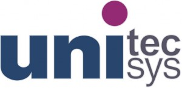

Компания:

Unitecsys

Телефон:

(057) 714-02-19

Веб-сайт:

[unitecsys.com](https://unitecsys.com/)

Адрес:

Харьков, проспект Ленина, 18/9, офис 2

Компанию **Unitecsys** посетил в июне 2009 года. Туда перешел работать лид нашей команды(компания gameloft) - и отзывался самым лучшим образом, а именно - "взрыв мозга", чего мне в gameloft и не хватало. Он так же сказал, что хорошие разработчики им в компанию всегда нужны, поэтому я решил попробовать и отправил резюме им.

Мне ответил Дмитрий Ефименко, который тут же предложил решить задачку по сбору требований и планированию решения. Проект "телефонная книга". Он скинул начальные условия и попросил меня высказывать все идеи по поводу того, как лучше организовать все и также собирать дополнительную информацию с него, как с заказчика. Сначала задача мне показалась вообще элементарной, но потом я понял на сколько решают "детали". Вот так меня в неспешном темпе почтовой переписки в итоге пригласили на собеседование.

На тот момент офис компании располагался напротив ХИРЕ( на территории ТочПрибора). Представлял из себя одну комнату, в которой находилось несколько человек(4 или 5) и все были заняты суровым проектированием. Сейчас, на сколько мне известно, после двух переездов, компания тоже живет в небольшом помещении и компактным составом.

Вопросы собеседования стали продолжением диалога по разработке проекта "телефонная книга". Тут меня сразу убрали по ООП, после чего перешли к структуре базы данных, где прогнали по специфике различных типов данных, движков таблиц, связей между таблицами и типами индексов. Тут было уже лучше, но все равно многого я не знал.

Собеседование я завалил, но Дмитрий в очередной раз вдохновил меня на более детальное изучение базы данных, ярко показав пробелы в знаниях. И, что немаловажно -  ответил на все технические вопросы после собеседования, а так же дал список литературы для самосовершенствования. И пусть говорят что у него ЧСВ зашкаливает, может быть оно даже так, I don't care, важно то, что 2 собеседования(первое еще в [ProgramAce](https://stepansuvorov.com/blog/2012/08/program-ace/)) с этим человеком дали мне очень хороший импульс для развития.

Запомнилась фраза, которую я теперь часто использую: "_PHP можно научить и обезьяну, но мы не кодеры, а программисты, поэтому должны уметь решать, а не просто писать код_"

Ну и список рекомендованной Дмитрием литературы:

- Алистер Коберн. Современные методы описания функциональных требований
- Том ДеМарко, Тимоти Листер. Вальсируя с Медведями. управление рисками в проектах по разработке программного обеспечения
- Том Демарко. Deadline. Роман об управлении проектами
- Фредерик Брукс. Мифический человеко-месяц или как создаются программные системы
- Элизабет Халл. Разработка и управление требованиями
- Стивен Р. Кови. Семь навыков высокоэффективных людей. Мощные инструменты развития личности
- Буч и др. Объектно-ориентированное проектирование
- Фаулер. Архитектура корпоративных программный приложений
