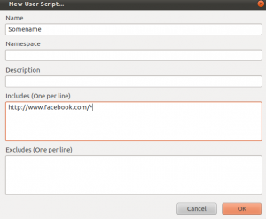

Для тех, кто может не знает, расскажу что для FF есть прекрасный аддон [Greasemonkey](https://addons.mozilla.org/en-US/firefox/addon/greasemonkey/), который позволят выполнять дополнительный javascript для страницы, тем самым позволяя ее изменять под наши нужды.

После того как вы поставите это дополнение в браузер, его необходимо будет активировать, и создать новый скрипт ( New User Script ). Появится следующее окошко:

где есть поля:

- name - имя вашего скрипта
- namespace - не обязательно
- description - тоже не обязательно, но лучше написать
- Includes - очень важное поле в нем нужно указать сайты (можно по маске), на которых мы хотим чтобы запускался наш скрипт(в нашем случае это будет http://www.facebook.com/\* )
- Excludes - противоположное предыдущему

После заполнение этого диалога должен открыться редактор текста, в котором мы и создадим наше дополнение.

Пишем следующий код(закомментированные строчки инструкции не трогаем):

var element = document.getElementById('pagelet\_side\_ads');
if(element)element.parentNode.removeChild(element);

var element = document.getElementById('pagelet\_ego\_pane\_w');
if(element)element.parentNode.removeChild(element);

Этими 4мя строчками мы удаляем 2 блока рекламы. Сохраняем текст. Перегружаем страничку - должно работать, если нет - пишем комментарий.

Так же стоит отметить что для greasemonkey существуюет множество уже готовых скриптов, которые можно найти на сайте [userscripts.org](http://userscripts.org), а вот ссылка на разобранный только что пример - [facebookClean](http://userscripts.org/scripts/show/140668).

Важная деталь для тех, кто будет создавать скрипты отдельно от greasemonkey, а потом пытаться их загрузить: файл необходимо называть расширением не просто .js, а **.user.js** - только в этом случае при открытии браузером он будет принят как скрипт greasemonkey.
