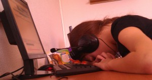
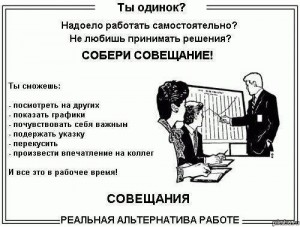

Пост представляет собой набор советов о том, как максимально эффективно проводить рабочее время.

Думаю стоит начать с вопроса **мотивации**. Если у вас нет мотивации делать работу и делать ее качественно - постарайтесь ее привить, попытаться найти смысл/интерес/пользу/выгоду. Если это так и не получилось сделать, то тут лучше задуматься не о эффективности своего труда, а о смене рабочего места и поиска более интересной работы.

Далее перейдем к вопросу **правильно обустроенного рабочего места**. Этот и следующий пункты скорее обращение-совет работодателю. Все постоянно необходимые предметы должны помещаться в рабочей области(или по простому: размер стола). Причем, стол должен стоять так, чтобы не приходилось сидеть спиной в проход, что тоже создает чувство незащищенности. Оборудование, которое по моему мнению тоже входит в характеристики рабочего места, должно удовлетворять потребностям. Если мы говорим о компьютере, то он не должен тормозить на штатных задачах. В случае быстрой разработки или постоянной аналитики бывает очень удобно использовать больше одного монитора.

Следующий пункт **комфорта** и отсутствия **отсутствия отвлекающих факторов**. Обязательно поддерживать условия приемлемые для работы: температура и влажность воздуха, уровень шума в помещении, воздействие солнечных лучей и посторонних запахов. Просто невозможно работать в условиях жары. При низкой влажности воздуха быстро устают глаза. В шумном помещении очень трудно сосредоточиться на задаче. Ну остальное думаю тоже понятно.

> "Слово «завтра» придумано для людей нерешительных и для детей"   Иван Сергеевич Тургенев

Распределяйте все задачи по **уровню приоритета**. В данном случае мы говорим о умении фокусироваться на более важных задачах не тратя время на низко приоритетные, которые вероятно вообще не нужно делать. Очень часто на работе(и не только на работе) может возникать такая  ситуация: у нас есть трудный вопрос, но мы вместо того чтобы заняться сразу же им находим для себя кучу второстепенных не важных дел типа "убрать на столе", "выкинуть мусор", "просмотреть фотографии с корпоратива" - все это отодвигает решение главной задачи и создает иллюзию того, что мы что-то делаем. Будьте честны по отношению к себе и умейте адекватно оценивать приоритетность дел.

> «Маленькая течь топит большой корабль», - не отвлекайся на всякую фигню, выполняя свою работу.

 

**Распыление внимания**. На что в большей части случаев уходит внимание, которое необходимо нам для работы? Это конечно же социальные сети, севозможные меседжеры и приходящие из них ссылки на картинки или статьи. Что делать, чтобы минимизировать утечку внимания? Что касается соцсетей: если вы уже совсем без них не можете жить, то постарайтесь хотя бы выделять конкретное для них время(например: 20 минут с утра или в обед), читать последние новости/смотреть фотографии, потом закрывать и забывать о них(в данном случае обязательно необходимо убрать все нотификейшены, которые будут приходить на почту). Что касается чатов, я рекомендую сделать 2 профиля: один рабочий с рабочими контактами и минимум друзей, второй - домашний. На счет ссылок есть хороший совет: если вы заняты, но статья показалась вам интересной - занесите ее себе в список избранного на дальнейшее прочтение. Хочу чтобы вы меня правильно поняли: я не за то, чтобы превращаться в асоциальных роботов, а за то, чтобы управлять своим временем.

Соблюдение **графика работы** тоже способствует более эффективному применению своих сил. Как желудок привыкает вырабатывать пищеварительный сок в определенное время, так и мозг привыкает работать в конкретные часы "на полную". Свободный и гибкий графики хороши для каких-то временных дел, ради которых необходимо сдвинуть рабочее время, но для постоянной работы желателен фиксированный режим работы. В данном случае хорошо определить для себя максимально продуктивное время и подстроить под него график работы.

**Постоянные овертаймы - это зло!**

**Отдых**, о котором тоже не нужно забывать. Нельзя работать на пределе возможностей и при этом не совсем не отдыхать. Причем отдых должен быть систематическим и регулярным. Иногда бывает полезно сделать перерыв в работе, когда не решается какая-то проблема и нужен свежий взгляд. Если мы говорим о длительном отдыхе - отпуске, который так же необходим, то, по моему мнению, он должен быть активный со сменой рода деятельности. Только в этом случае вам удастся полностью восстановить силы и продолжить качественно трудиться.

**Планирование** также может оптимизировать нашу работу. Главное, что необходимо помнить: нельзя планировать и выполнять задачи одновременно, так как это будет крайне не эффективно. В планировании как и в любом другом процессе есть 2 крайности, к которым не следует стремиться:

- "планирование ради планирования" - когда мы большую часть времени планируем одну функцию, потом отказываемся от своих планов, а проект стоит на месте
- быстрые непродуманные решения, от которых в последствии придется отказаться

Один из самых важных моментов планирования - это разбитие больших заданий(к которым не знаем как подступиться) на небольшие подзадачи(которые сраму можем делать).

Если вы не хотите тратить время в пустую - **откажитесь от долгих совещаний**.

И напоследок совет для тех, кто еще не обладает достаточным опытом в сфере своих обязанностей, - тут тоже есть 2 крайности:

- можно постоянно дергать и отвлекать от работы сотрудников с большим опытом задавая им вопросы(что получится не эффективно для ваших коллег)
- сидеть на одном и том же вопросе очень долгое время и стараться найти решение самостоятельно ( что будет не эффективно для вас)

В этом вопросе нужно четко чувствовать момент, когда перебрали все возможные решения и идеи, которые были - тогда следует обратиться за помощью к кому-то другому.

Если вы из своего опыта и наблюдений можете подсказать еще что-то - буду рад выслушать в комментариях.
