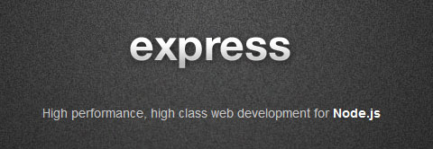

Если вы давно пишете на JavaScript, вы понимаете комфорт использования jQuery. Так же и для серверной стороны: когда вы создаете приложение под node.js, удобно будет использовать express фреймворк модуль (npm install express). Хотел написать пост с разбором базовых задач на нем, но похоже офсайт таки разродился [нормальными примерами](https://expressjs.com/api.html).
