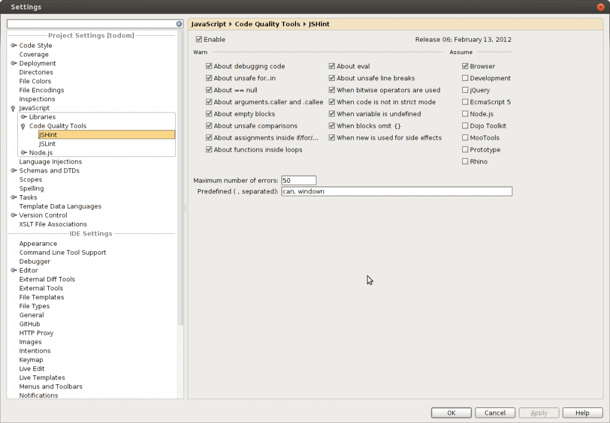
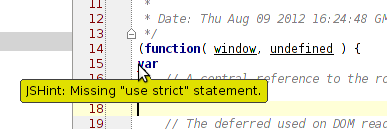

[JSHint](https://www.jshint.com/) - бесплатный инструмент для проверки JavaScript кода на соответствие стандартам оформления кода и внутри командным соглашениям. Возник как ответвление от [JSLint](https://www.jslint.com/), который разработал автор JSON формата Дуглас Крокфорд. Инструмент не имеет фиксированных правил и легко конфигурируется под конкретные требования к коду.

Как пишет создатель **JSHint**: "_It is quickly transforming from a tool that helps developers to prevent bugs to a tool that makes sure you write your code like Douglas Crockford._"

Что касается **WebStorm**, то поддержка JSHint/JSLint(включены 2 инструмента) появилась начиная с версии **3.0**. Включается довольно просто в настройках:



Там же мы можем задать все необходимые параметры.

После чего у нас появятся подсказки об ошибках в оформлении кода:



На официальном сайте есть довольно подробная [документация](https://www.jshint.com/docs/).

Сам WebStrorm хранит настройки в файле .idea/jsLinters/jshint.xml, соследующей структурой:

```xml
<?xml version="1.0" encoding="UTF-8"?>
<project version="4">
<component name="JSHintConfiguration">
<option bitwise="true" />
<option curly="true" />
<option noarg="true" />
<option forin="true" />
<option strict="true" />
<option noempty="true" />
<option undef="true" />
<option eqeqeq="true" />
<option nonew="true" />
<option browser="true" />
<option maxerr="50" />
<option predef="can, windown" />
</component>
</project>
```

К сожалению, WebStorm еще не подружили с .json стандартным форматом для JSHint. Пример .json варианта можно посмотреть [тут](https://github.com/jupiterjs/canjs/blob/master/.jshintrc).
