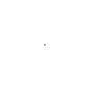
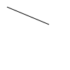
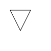
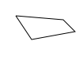
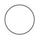

Этот пост будет представлять собой постоянно расширяющийся список геометрических фигур и функций для их отрисовки на canvas.

Для всех случаев будем по умолчанию считать что мы уже определили canvas и получили ссылку на его контекст:

``var canvas = document.getElementById('`canvas`'); var ctx    = canvas.getContext('2d');``

Фигура

Функция

Точка

т.к. родного метода для рисования точки нет, приходится рисовать линию в 1 пиксель:

function drawPixel(x, y)
{
ctx.beginPath();
ctx.moveTo(x,y);
ctx.lineTo(x+1,y+1);
ctx.stroke();
}

Прямая линия(Отрезок)

function drawLine(x1, y1, x2, y2)
{
ctx.beginPath();
ctx.moveTo(x1,y1);
ctx.lineTo(x2,y2);
ctx.stroke();
}

Кривая

?

Треугольник

function drawTriangle(x1, y1, x2, y2, x3, y3)
{
ctx.beginPath();
ctx.moveTo(x1, y1);
ctx.lineTo(x2, y2);
ctx.lineTo(x3, y3);
ctx.lineTo(x1, y1);
ctx.stroke();
}

Четырехугольник

function drawTetragon(x1, y1, x2, y2, x3, y3, x4, y4)
{
ctx.moveTo(x1, y1);
ctx.lineTo(x2, y2);
ctx.lineTo(x3, y3);
ctx.lineTo(x4, y4);
ctx.lineTo(x1, y1);
ctx.stroke();
}

Прямоугольник

function drawRect(x1, y1, width, height)
{
ctx.fillRect(x1, y1, width, height);
}

Квадрат

function drawSquare(x, y, width)
{
ctx.fillRect(x, y,width, width);
}

Круг

function drawCircle(x, y, radius)
{
ctx.beginPath();
ctx.arc(x,y,radius,0,Math.PI\*2,true);
ctx.stroke();
}
