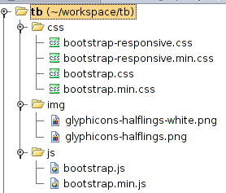

Перед нами стала задача определить библиотеку для создания UI на проекте. Кроме JQueryUI и Dojo появился вариант Twitter Bootstrap, который мы решили рассмотреть более подробно.

Для начала выкачаем последнюю версию с [главной страницы](https://twitter.github.com/bootstrap/index.html "твитер бутстрап").

Файловая структура довольно простая:

Создаем HTML-файл, в котором будем экспериментировать:

<!DOCTYPE html>
<html>
<head>
    <title>Bootstrap 101 Template</title>
    <!-- Bootstrap -->
    <link href="css/bootstrap.min.css" rel="stylesheet">
</head>
<body>
<h1>Hello, world!</h1>

</body>
</html>

Нам нужно подключить всего 3 файла для работы: bootstrap, его стили ну и jquery. Теперь посмотрим что он умеет:

- Button groups
- Button dropdowns
- Navigational tabs, pills, and lists
- Navbar
- Labels
- Badges
- Page headers and hero unit
- Thumbnails
- Alerts
- Progress bars
- Modals
- Dropdowns
- Tooltips
- Popovers
- Accordion
- Carousel
- Typeahead

Пройдемся по списку и попробуем реализовать это все. Ну или хотя бы основное, на основе чего можно будет разобрать уже другие элементы.

Внимание!  У большинства элементов есть возможность задания всех параметров как через data- атрибут, так и через options конструктора. Более того, некоторые элементы библиотека инициализирует сама.

 

**Button groups**.

У групп кнопок есть 4 основных вида поведения:

- #### **Stateful** (Может показывать состояние загрузки при нажатии)
    
- #### **Single toggle** ( Переключалка: нажата/отжата)
    
- #### **Checkbox** ( Набор переключалок )
    
- #### **Radio** (Набор переключалок с одной активной )
    

Разберем самую интересную - ту, которая предает состояние загрузки:

<button type="button" id="btn" data-loading-text="Loading...">Loading state</button>

$('#btn').click(function(){
    var $button = $(this).button('loading');
    setTimeout(function(){
                $button.button('reset');
            }, 1500);
});

 

**Navigational tabs, pills, and lists**.

<ul>
    <li><a href="#home" data-toggle="tab">Home</a></li>
    <li><a href="#profile" data-toggle="tab">Profile</a></li>
    <li><a href="#messages" data-toggle="tab">Messages</a></li>
    <li><a href="#settings" data-toggle="tab">Settings</a></li>
</ul>

$('#myTab a').click(function (e) {
            e.preventDefault();
            $(this).tab('show');
        })

 

**Alerts**.

Something goes wrong
    <a data-dismiss="alert" href="#">&times;</a>

$(".alert").alert()
$(".alert").on('close', function(){ alert('Closed!'); });

 

**Modals**.

    

        <button type="button" data-dismiss="modal" aria-hidden="true">&times;</button>
        <h3>Modal header</h3>
    

    

        
One fine body…

    

    

        <a href="#">Close</a>
        <a href="#">Save changes</a>
    

$('#myModal').modal('show')

**Dropdowns**.

    <a data-toggle="dropdown" href="#">Dropdown trigger</a>
    <ul role="menu" aria-labelledby="dLabel">
        <li>some option1</li>
        <li>some option2</li>
        <li>some option3</li>
    </ul>

$('.dropdown-toggle').dropdown()

 

**Tooltips**.

<a data-placement="bottom" rel="tooltip" href="#" data-original-title="Tooltip on top">Tooltip on top</a>

$('a[rel="tooltip"]').tooltip()

 

**Popovers**.

<a id="popup" data-title="Some Title" data-content="Lorem and rest of ipsum"/>Click</a>

$('#popup').popover();

 

**Accordion**.

В данной библиотеки он элемент данного типа имеет название **Collapse**.

    

        

            <a data-toggle="collapse" data-parent="#accordion" href="#collapseOne">
                Collapsible Group Item #1
            </a>
        

        

            

                Anim pariatur cliche...
            

        

    

    

        

            <a data-toggle="collapse" data-parent="#accordion" href="#collapseTwo">
                Collapsible Group Item #2
            </a>
        

        

            

                Anim pariatur cliche...
            

        

    

$(".collapse").collapse()

 

**Carousel**.

Карусель как карусель тут нет никакой специфике, которую бы стоило отдельно разобрать, so RTFM.

 

**Typeahead**.

Вот это более интересный элементик - автоподсказка.

<input type="text" data-provide="typeahead" id="typeahead">

var alCities = ['Baltimore', 'Boston', 'New York', 'Tampa Bay', 
  'Toronto', 'Chicago', 'Cleveland', 'Detroit', 'Kansas City', 
  'Minnesota', 'Los Angeles', 'Oakland', 'Seattle', 'Texas'].sort();
$('#typeahead').typeahead({source: alCities, items:5});

 

Все(или большая часть) примеры взяты с [офсайта](https://twitter.github.com/bootstrap/), дополнены или переделаны для более быстрого осмысления. Успешных испытаний.
