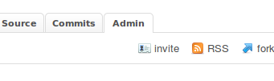
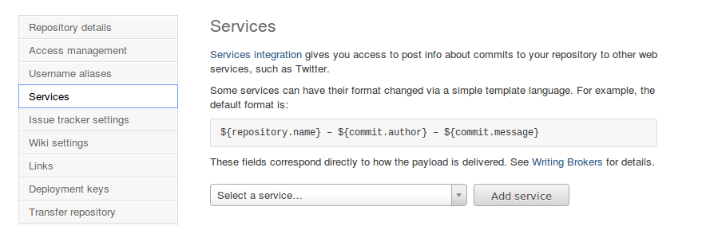

Наш текущий проект мы держим на bitbucket и вот стал вопрос о автоматической выгрузке кода при каждом пуше в репозиторий. Попробуем сделать это на JavaScript.

Для начала составим общий план что нам нужно:

1\. Настроить **bitbucket**, чтобы он оповещал как-то наш сервер о том, что в репозиторий добавлена новая версия.

2\. Выполнить необходимые настройке на стороне **нашего сервера**, чтобы мы смогли принимать информацию от **bitbucket.**

3\. Создать **скрипт** разворачивания системы.

 

Настройка **bitbucket**.

Изучение мануала **bitbucket** сервиса показало что он имеет множество всевозможных способов оповещения: AgileZen, AppHarbor, Bamboo, Basecamp, Campfire, CIA.vc, Cube, Datadog, Donedone ,Email, Email Diff, Flowdock, Fogbugz, FriendFeed, Geocommit, Grove, HipChat, Issues, Jenkins, Lighthouse, Masterbranch, Pivotal Tracker, POST, Read the Docs, Rietveld, Superfeedr, Twitter. В этом списке есть обычный **POST**, который мы можем послать себе на сервер.

Для настройки нам необходимо зайти в закладочку **Admin** нашего репозитория(если у вас нет такой закладочки - вероятно вы не админ):

Далее выбираем пункт из меню **Services**:

И тут добавляем новый сервис **POST**, в который прописываем путь к нашему серверу. По настройке это **bitbucket** все.

 

Настройка **нашей стороны**.

Так как мы выбрали JavaScript, то логично было бы взять вебсервер node.js. Для более удобной работы поставим сразу на него express фреймворк.

Создаем файл deploy.js со следующим содержанием:

var express = require('express');
var app = express();
app.listen(8888);

Порт выбираем произвольный, но в любом случае лучше брать отличный от 80 и других занятых - во избежание конфликтов. Чтобы убедится в том что сервер работает, добавим еще вывод какой-то произвольной текстовой информации, и получим:

var express = require('express');
var app = express();

app.get('/', function(req, res){
    res.send( 'Server is working, time: ' + (new Date));
});

app.listen(8888);

Теперь запустим наш скрипт с помощью node.js командой в консоли:

$: node todom\_deploy.js

Убедимся что ошибок не выдало и перейдем в браузере на адрес _http://localhost:8888/_ . Работает? Отлично. Идем дальше. Организуем прием пост данных. Для этого добавляем следующую строчку вверху:

app.use(express.bodyParser());

и потом определяем роутер для post запроса:

app.post('/bitbucket-push', function(req, res){
    res.send(req.body);
    //скрипт разворачивания проекта будет тут
});

Второй шаг выполнен мы получили адрес, который необходимо прописать в настройки bitbucket - _http://localhost:8888/bitbucket-push_. (вместо localhost указываем свой хост)

 

Написание **скрипта** деплоймента.

Тут можно много всякого разного написать, у кого на сколько фантазии хватит, но мы ограничимся пока только выливанием кода. Для этого нам нужно:

задаем необходимую директорию:

process.chdir(directory);

откатываем изменения, если они были:

exec('git reset --hard HEAD', commandLog);

делаем пулл свеженького кода:

exec('git pull ', commandLog);

exec  - это такой модуль для выполнения shell команд, который можно получить следующим путем:

var exec = require('child\_process').exec;

commandLog - колбэк функция, которая может быть реализована вот так:

function commandLog(error, stdout, stderr) {
    console.log('stdout: ' + stdout);
    //console.log('stderr: ' + stderr);
    if (error !== null) { console.log('exec error: ' + error); }
}

 

Ну и теперь весь код максимально сжато:

var os = require("os");
var express = require('express');
var app = express();
app.use(express.bodyParser());

var PROJECT\_DIRECTORY = "/var/www/ourproject";

app.get("/", function(req, res){
    res.send( "Server is working, time: " + (new Date));
});

app.post("/push", function(req, res){
    if(req.body.payload){
        var deploy = new Deploy(PROJECT\_DIRECTORY, JSON.parse(req.body.payload));
        deploy.execute();
    }else{
        res.send("incorrect params");
    }
});

app.listen(8888);

И сам класс, который в принципе можно разместить в отдельном файле:

function Deploy( directory, options )
{
    this.directory = directory;
    this.git\_options = {};
    this.git\_options.branch = options.commits[0].branch;
    this.git\_options.message = options.commits[0].message;
}

Deploy.prototype.execute = function(){
    var exec = require("child\_process").exec;

    try{
        process.chdir(this.directory);
        exec('git reset --hard HEAD', commandLog);
        exec('git pull ', commandLog);
    }catch(e){
        console.log(e);
    }
}

 

Тут еще можно добавить проверку ветки, т.е. выливать код только из главной ветки; что-то придумать с сообщением или автором, в общем дальше уже на сколько фантазии хватит, а по основному это все.
