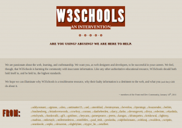

Случайно наткнулся на довольно интересный сайт W3Fools, который создан в протест к известному W3Schools. Создатели сайта утверждают, что  портал W3Schools несет вред веб-сообществу предоставляя информацию со множеством ошибок и неточностей. Далее они приводят все эти неточности и ошибки.

Более того представители W3Fools предлагают забанить W3Schools у себя в результатах поиска. Продублирую инструкцию для google тут на русском:

Переходим на страницу [https://www.google.com/reviews/t](https://www.google.com/reviews/t) и добавляем домен w3schools.com в черный список (будьте внимательны, и не добавляйте вначале www, так как этот сайт с целью раскрутки использует разные поддомены, такие как ww, www2, и так далее )

**UPD (7.11.2014)** : Гугл убрал возможность бана различных сайтов в персональной выдаче и вместо этого рекомендует пользоваться расширением для хрома - [Personal Blocklist](https://chrome.google.com/webstore/detail/personal-blocklist-by-goo/nolijncfnkgaikbjbdaogikpmpbdcdef "chrome.google.com").
