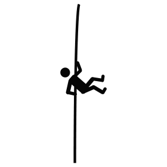

Как и обещал: выкладываю задачи на логику, которые мы даем в конце собеседования.

## Задача1 - Монетки

Есть девять одинаковых по виду монет, одна из которых фальшивая.  Известно, что фальшивая монета легче по весу(но не существенно). Необходимо за минимальное число взвешиваний на двухчашечных весах(смотреть иллюстрацию) найти эту фальшивую монету. Задача сводится к нахождению алгоритма.

 

## Задача2 - Шарики

Более сложный вариант задачи с монетками.

У нас есть 12 шариков, один из которых отличается по весу от остальных, но мы не знаем легче он либо тяжелее. И нам также необходимо придумать алгоритм, по которому мы сможем за минимальное число взвешиваний(в данном случае это будет 3) найти этот отличающийся шарик.

 

## Задача3 - Фитиль

У Вас есть два шнура (фитиля). Каждый шнур, подожженный с конца, полностью сгорает дотла ровно за один час, но при этом горит с неравномерной скоростью[.](https://potehechas.ru/zadachi/zadachi_7.shtml) Как при помощи этих шнуров и зажигалки отмерить время в 15 минут?

 

## Задача4 - Скалолаз

Путешественник подошёл к крутому обрыву глубиной 100 метров, возможности и времени обойти его у него не было, а спускаться надо. Ровно посередине обрыва (на глубине 50 метром) росло прочное дерево. У путешественника в рюкзаке оказалась прочная верёвка длинною 75 метров и острый нож, которым он может разрезать верёвку в любом месте сколько угодно раз. Как путешественнику безопасно спуститься вниз с обрыва? (Прыжки с любой высоты запрещены условием)

 

## Задача5 - Мудрецы

В одной деспотичной стране король созвал всех придворных мудрецов (количество их не принципиально, поэтом без ограничения общности будем считать, что их 100 человек) и объявил им следующее: Завтра их всех выведут и завяжут глаза, затем каждому на голову наденут колпак черного или белого цвета и снимут повязки. Каждый сможет видеть цвет колпака всех остальных, но не может видеть свой колпак. Каждому в колонне зададут вопрос: Какого цвета на тебе колпак? Если мудрец ответит правильно, его оставят в живых. Если неправильно, значит он недостоин быть мудрецом и его казнят.

Какую стратегию надо избрать мудрецам, чтобы как можно больше из них остались в живых? На размышления и совещания им дается ровно одна ночь.

 

 

продолжение следует...

если были какие-то неточности в условии - поправьте пожалуйста в комментрии.
