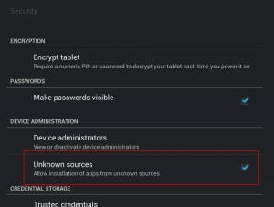

Перекопав кучу статей и постов, я понял что не так просто получить **права суперпользователя**(**root**) в системе **Android** для **Asus Transformer Infinity**, особенно если она обновлена до **4.1 Jelly Bean**.

Приготовление:

1) Убеждаемся в том, что аккумулятор полностью заряжен

2) Подключаем планшет(без докстанции) через кабель питания-USB к компьютеру

3) На планшете в настройках ставим галочку на  "Неизвестные источники" (_Unknown Sources_)

4) В настройках включаем "USB-отладку"(USB Debugging)

 

На этом приготовление окончено, переходим к **настройке**:

1) Первым делом нам нужно разлочить асусовую прошивку. Для этого идем на [офсайт](https://support.asus.com/Download.aspx?SLanguage=en&m=ASUS+Transformer+Pad+Infinity+TF700T&p=28&s=1) и скачиваем **Unlock Device App: Unlock boot loader**. Копируем этот файл на Андройд устройство и выполняем. При этом нужно согласится со всеми лицензиями и подтвердить что всем это мы делаем на свой страх и риск. После чего планшет перезагрузится и можно двигаться дальше.

2) Скачиваем от [сюда](https://goo.im/devs/OpenRecovery/tf700t) последнюю версию [TWRP](https://teamw.in/project/twrp2 "TWRP это загрузчик recovery mode (режима восстановления)"), а так же [необходимый софт](https://stepansuvorov.com/share/Install_Recovery.zip) для установки самого загрузчика на планшет. После чего распаковываем все в одну папку, переименовываем файл TWRP в "_recovery.blob_" и запускаем "Recovery Install Tool.bat" (Скрипт не большой, и, для любителей Linux не должно составить труда переписать его под себя).

3) Осталось только скачать [спец прошивку](https://stepansuvorov.com/share/CWM-SuperSU-v0.99.zip "прошивка SuperSU") для суперпользователя, загрузить ее в корень на планшет и установить используя TWRP.

 

\* Уточнения:

Чтобы загрузить устройство в режиме отладки (и TWRP там же):

- выключаем устройство
- включаем комбинацией: кнопка включения + уменьшение громкости (удерживаем вместе минимум 5 секунд)

Для переключения по опциям в отладочном меню:

- кнопка уменьшения громкости - переход по опциям
- кнопка увеличения громкости - выбор(вход) опции

 

Если что-то не получилось либо не понятно - задавайте вопросы в комментариях - постараюсь на них ответить.
