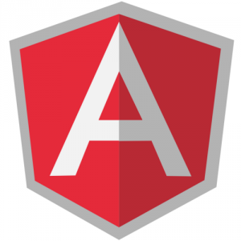

> Внимание! это **AngularJs** (старая версия фрейморка **Angular**), если вы ищете информацию по **Angular**, то рекомендую вам [этот скринкаст](http://learn.javascript.ru/screencast/angular). 


**UPD**: Пост обновлен 25.10.2015 и является актуальным для **Angular1.4**.

Обычно **список литературы** дается в конце, но в данном случае разумно было бы предоставить все полезные ссылки сразу же.

Итак, что полезного есть на официальном сайте:

- [Быстрый старт](https://docs.angularjs.org/tutorial/ "angularjs быстрый старт") (пошаговая разработка простого приложения)
- [Руководство разработчика](https://docs.angularjs.org/guide/ "Руководство AngularJs") и [API](https://docs.angularjs.org/api "AngularJs API")

Статьи на хабре(полистать, а потом вернуться полистать еще раз):

- [AngularJS — фреймворк для динамических веб-приложений от Google](https://habrahabr.ru/post/149060/)
- [Практикум AngularJS — разработка административной панели](https://habrahabr.ru/post/149757/)

Готовый скелет(структура с файлами, директориями и веб-сервером), с которого можно начинать создания своего приложения берем тут: [github](https://github.com/angular/angular-seed)( либо [zip](https://github.com/angular/angular-seed/archive/master.zip)).

Преимущества использования AngularJS(от [сюда](https://habrahabr.ru/post/142590/)):

- Dependency injection в стандартной поставке
- Возможности модульного тестирования в стандартной поставке
- e2e тесты позволяют легко мокать запросы
- Декларативность(использование HTML атрибутов по максимуму)
- Отличное open source сообщество
- Дружелюбность к REST
- Scopes, bindings и watches

Немного видео(на английском):

- [AngularJS Hello World](https://www.youtube.com/watch?v=uFTFsKmkQnQ) ( 4 минуты )
- [AngularJS Tutorial](https://www.youtube.com/watch?v=WuiHuZq_cg4) ( 12минут )
- [AngularJS - Routes and Partials](https://www.youtube.com/watch?v=zogrnQjHZAM) ( 14 минут )

Крайне рекомендую все [ролики о AngularJS от egghead](https://egghead.io/technologies/angularjs), очень хорошее инвестирование времени. К ним вы сможете еще не раз возвращаться и пересматривать.

Вспомогательные инструменты на данный момент по прежнему находятся в состоянии зародыша(либо выкидыша) но взглянуть все равно стоит:

- [AngularJS Batarang](https://chrome.google.com/webstore/detail/angularjs-batarang/ighdmehidhipcmcojjgiloacoafjmpfk ) -  в дополнение Chrome Developer Tools.
- [ng-inspector](https://ng-inspector.org/) - расширение для Chrome направленное на анализ scope
- [AngularJS Inspect Watchers](https://chrome.google.com/webstore/detail/angularjs-inspect-watcher/gdfcinoagafkodbnkjemaajfahnmfkhg?hl=en) - анализ вотчеров на сайте

# Быстрый старт

Давайте теперь вместе проделаем шаги из "быстрого старта".

Убеждаемся в том что у нас стоит:

- [git](https://git-scm.com/download)
- [node.js](https://nodejs.org/)
- [karma](https://karma-runner.github.io/) (npm install -g karma)

Выкачиваем себе тренинг проект:

[shell gutter="false"] $ git clone --depth=14 https://github.com/angular/angular-phonecat.git [/shell]

Мы используем специальный флаг **_-depth==14**, чтобы получить только последние 14 коммитов.

Перейдем в директорию проекта:

[shell gutter="false"] $ cd angular-phonecat [/shell]

## Самонастройка(Bootstrapping)

В начале каждого пункта будет дана команда, используя которую можно откатиться до состояния кода конкретного пункта.

[shell gutter="false"] $ git checkout -f step-0 [/shell]

Запустим наш web-сервер:

[shell gutter="false"] $ npm start [/shell]

Если все отработало без ошибок - можем переходить на  [http://localhost:8000/app/index.html](http://localhost:8000/app/index.html)

Открываем файл app/index.html:

```html
<!doctype html>
<html lang="en" ng-app>
<head>
 <meta charset="utf-8">
 <title>My HTML File</title>
 <link rel="stylesheet" href="bower_components/bootstrap/dist/css/bootstrap.css">
 <link rel="stylesheet" href="css/app.css">
 <script src="bower_components/angular/angular.js"></script>
</head>
<body>
 <p>Nothing here {{'yet' + '!'}}</p>
</body>
</html>
```

Вот она наша первая песочница для **AngularJs**. Важные моменты, которые мы должны вынести из этого кусочка HTML:

```html
<html lang="en" ng-app>
```

_ специальный **ng-app** атрибут, указывающий на то, какой элемент в DOM будет корневым для приложения(Т.е. мы можем сказать, что AngularJs будет использовать весь документ, либо какую-то конкретную его часть).

Nothing here `{{'yet' + '!'}}`

Двойная фигурная кавычка используется для шаблонов: внутри можно указать переменную, выражение(подробнее [в части о шаблонах](https://stepansuvorov.com/blog/2013/06/start-with-angularjs-part2/)).

Нам предлагают поиграться и заменить эту строчку на что-то такое:

```html
 <p>1 + 2 = {{ 1 + 2 }}</p>
 ```

Теперь проясним что происходит при инициализации AngularJs, которая происходит автоматически по умолчанию:

1. создается специальный объект Инжектор([$injector](https://docs.angularjs.org/api/AUTO.$injector)), по средствам которого получаются все остальные сущности
2. Инжектор создает [$rootScope](https://docs.angularjs.org/api/ng.$rootScope), что является контекстом для модели нашего приложения
3. фреймворк "компилирует" DOM начиная с ngApp используя при этом rootScope.

После того как приложение выполнило этап самонастройки оно ждет событий от браузера, по которым, в случае необходимости, будут реагировать модели.

## MVC

```
$ git checkout -f step-2
```

**Представление (View)**

В AngularJS **view** компонент представляет из себя отображение модели через HTML шаблон. Это означает, что при изменение модели, представление тоже будет меняться.

Зайдем в _app/index.htm_ и посмотрим на содержание body:

```html
<li ng-repeat="phone in phones">
  <span>{{phone.name}}</span>
  <p>{{phone.snippet}}</p>
</li>
```

- phones - переменная(массив объектов), которую мы задали в контроллере(о нем позже)

- [ng-repeat](https://docs.angularjs.org/api/ng.directive:ngRepeat) - директива, которая запускает перебор коллекции(аналог forEach)

- {{phone}} - элемент коллекции

- {{phone.name}}, {{phone.snippet}} - свойства элемента коллекции

Т.е. другими словами: сколько  элементов будет в массиве phones - столько `<li>` выведет view.

Поэкспериментируем с шаблоном и выведем что-то такое:

```html
 <p>Total number of phones: {{phones.length}}</p>
``` 

или такое(так тоже можно использовать директиву ng-repeat):

```html
<table>
<tr><th>row number</th></tr>
<tr ng-repeat="i in [0, 1, 2, 3, 4, 5, 6, 7]"><td>{{i+1}}</td></tr>
</table>
```

**Контроллер (Controller)**

Еще раз посмотрим на _app/index.htm_ и обратим внимание на атрибут тега body:

```html
<body ng-controller="PhoneListCtrl">
```

_ в директиве [ng-controller](https://docs.angularjs.org/api/ng.directive:ngController) мы указываем, какой контролер должен обрабатывать данную область.

PhoneListCtrl  - это имя метода, который мы можем найти тут app/js/controllers.js:

```javascript
function PhoneListCtrl($scope) { 
  $scope.phones = [ 
    { "name": "Nexus S", "snippet": "Fast just got faster with Nexus S."}, 
    {"name": "Motorola XOOM™ with Wi-Fi", "snippet": "The Next, Next Generation tablet."}, 
    {"name": "MOTOROLA XOOM™", "snippet": "The Next, Next Generation tablet."} 
    ]; 
}
```

В нашем случае мы просто заносим в [$scope](https://docs.angularjs.org/api/ng.$rootScope.Scope) коллекцию объектов, чтобы потом ее отобразить во вью.

**$scope, $rootScope**

В AngularJS **$scope** и **$rootScope** - это ключевые сущности для передачи данных между моделью и отображением посредством контроллера. При этом $rootScope - это корневой scope, к которому имеют доступ все, а  $scope - scope определенного контроллера. Т.е. в нашем примере мы занесли данные только в scope нашего контроллера(_PhoneListCtrl_), а если бы мы хотели, чтобы другие контроллеры тоже получили доступ, то нам необходимо было использовать $rootScope. Более подробно можно почитать [тут](https://docs.angularjs.org/api/ng.$rootScope.Scope). ( _также в тему_: [Передача данных между сущностями AngularJS](https://stepansuvorov.com/blog/2014/09/angularjs-data-transfer/) )

Теперь, когда мы знаем что такое Скоуп можно поэкспериментировать и с ним записать другие данные и попытаться отобразить их в представлении:

```javascript
$scope.hello = "Hello, World!"
$rootScope.hello = "Hello, Universe!"
```

**!Внимание.** Чтобы использовать $rootScope его также нужно добавить как зависимость в контроллере:

```javascript
function PhoneListCtrl($scope, $rootScope)
```

## Unit-тесты в AngularJS

Посмотрим пример теста в test/unit/controllersSpec.js:

```javascript
describe('PhoneCat controllers', function() {

  describe('PhoneListCtrl', function(){

    it('should create "phones" model with 3 phones', function() { 
      var scope = {}, 
      ctrl = new PhoneListCtrl(scope);

      expect(scope.phones.length).toBe(3); 
    }); 
  }); 
});
```

Кто разбирался с [Jasmine](https://stepansuvorov.com/blog/2012/10/jasmine-%D0%B8-%D1%8E%D0%BD%D0%B8%D1%82-%D1%82%D0%B5%D1%81%D1%82%D1%8B/), нет ничего особо сложного: в данном тесте мы проверяем контроллер и хотим убедиться что он занес в коллекцию 3 записи.

**Запуск тестов используя [karma](https://karma-runner.github.io/).**

Для запуска тестов выполняем команду:

```
$ npm test
```

И после этого у нас должен запуститься тест-сервер и открыться 2 браузера(Chrome и Firefox). В двух браузерах будут выполнены тестовые манипуляции, после чего вы должны увидеть в у себя в консоле примерно следующее:

```
Chrome 46.0.2490 (Mac OS X 10.11.0): Executed 1 of 1 SUCCESS (0.045 secs / 0.039 secs)
Firefox 41.0.0 (Mac OS X 10.11.0): Executed 1 of 1 SUCCESS (0.033 secs / 0.031 secs)
TOTAL: 2 SUCCESS
```

Теперь можете попробовать что-то изменить в коде. Заметили? Тесты были запущены заново, т.е. после каждого изменения karma будет выполнять тесты. Файлы, за изменением которых нужно наблюдать, можно выставить в конфиге( test/karma.conf.js)

_Продолжение следует..._ 

**UPD:** [AngularJs Basics](https://www.angularbasics.co.uk/ "на английском ") - прекрасно структурированный сайт документации

## все части рубрики "С чего начать изучение AngularJS":

- [Часть1 - С чего начать изучение AngularJS.](https://stepansuvorov.com/blog/2012/12/%D1%81-%D1%87%D0%B5%D0%B3%D0%BE-%D0%BD%D0%B0%D1%87%D0%B0%D1%82%D1%8C-%D0%B8%D0%B7%D1%83%D1%87%D0%B5%D0%BD%D0%B8%D0%B5-angularjs/)
- [Часть2 – Шаблоны оживают.](https://stepansuvorov.com/blog/2013/06/start-with-angularjs-part2/)
- [Часть3 – Ох уж эти сервисы.](https://stepansuvorov.com/blog/2015/02/%D1%81-%D1%87%D0%B5%D0%B3%D0%BE-%D0%BD%D0%B0%D1%87%D0%B0%D1%82%D1%8C-angularjs-%D1%87%D0%B0%D1%81%D1%82%D1%8C3/)
