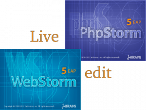

Как извесно с пятой версии в **WebStorm/PhpStorm** появилась новый плагин под названием **LiveEdit**, который дает возможность писать код и сразу смотреть результат.

Вот прекрасное видео, которое демострирует возможности плагина:

<iframe src="http://www.youtube.com/embed/TnnVl3ydIB0" frameborder="0" width="560" height="315"></iframe>

 

Если понравилось - пару слов о найстройке:

По умолчанию плагин уже активирован в редакторе, нужно только проверить в настройках чтобы стояли галочки:

Далее найти файл

/PhpStorm/plugins/JavaScriptDebugger/extensions/HowToInstallGoogleChromeExtension.html

с инструкцией по установке **расширения для Chrome**: в большей части случаев она заключает в том, чтобы установить новое расширение  из файла /PhpStorm/plugins/JavaScriptDebugger/extensions/jb.crx

Для **Linux** есть своя специфика:

$ sudo mkdir -p -m0777 /opt/google/chrome/extensions

На свякий случай ссылка на страничку с возможными проблемами: [http://confluence.jetbrains.net/display/WI/LiveEdit](http://confluence.jetbrains.net/display/WI/LiveEdit)
