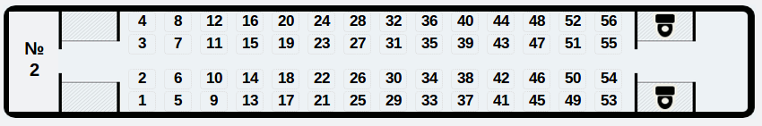
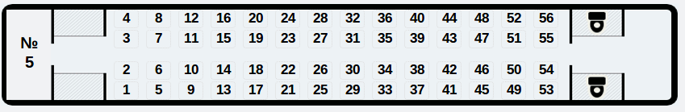
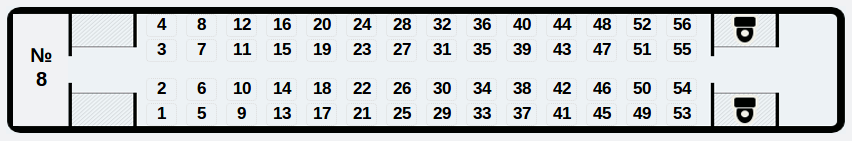
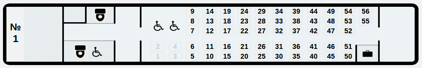
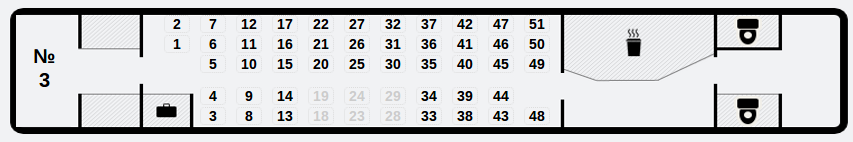
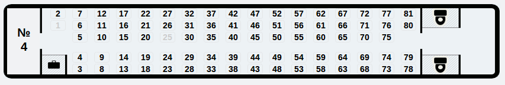
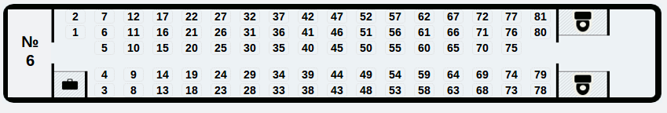
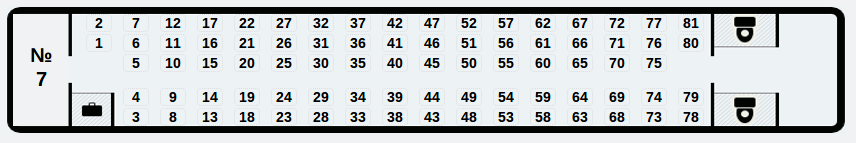
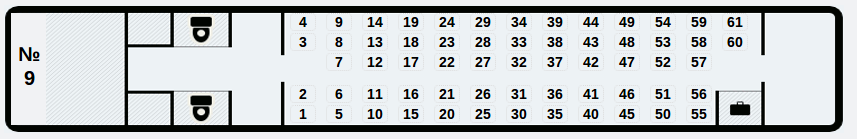

Так как вот этот поездовый ре[пост](https://stepansuvorov.com/blog/2012/06/%D1%81%D1%85%D0%B5%D0%BC%D0%B0-%D1%80%D0%B0%D1%81%D0%BF%D0%BE%D0%BB%D0%BE%D0%B6%D0%B5%D0%BD%D0%B8%D1%8F-%D0%BC%D0%B5%D1%81%D1%82-skodahyundai/#comment-1214 "Схема расположения мест Skoda&Hyundai") оказался полезным, пишу пост с более актуальной информацией на данный момент. Расположение мест во всех вагонах поезда Hyundai.

Вагоны первого класса: **2, 5, 8**:

Вагоны первого класса: **1, 3, 4, 6, 7, 9:**

 

**WIFI:** есть, но рабочие роутеры не в каждом вагоне, так что скорость оставляет желать лучшего. Для чата, загрузки страничек вполне хватает, но не больше.

**Розетки:** в первом классе – каждое кресло оборудовано индивидуальной розеткой, во втором - через ряд по две розетки с каждой стороны(в борте вагона)

**Цены**(_08.12.12_): тут остается только аплодировать стоя руководству укрзализныци за их распределенную систему основанную на принципе "чем раньше покупаешь билет - тем больше за него платишь". Такое может быть только у нас, итак, если вы покупаете билет сегодня на сегодня цены следующие:

первый класс - **283,68 грн**

второй класс - **192,52 грн**

!НО, если вы заранее планируете свою поездку и хотите купить билеты заранее, то заплатите намного больше:

первый класс - **376,87 грн**

второй класс - **254,68 грн**

(_прим_: Ради чего эта программа? Чтобы люди не инвестировали деньги на поездку заранее, а в последний день прям перед поездом брали билет толпясь в очередях и опаздывая? )
