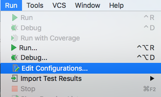
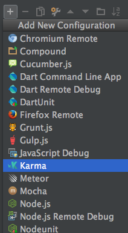
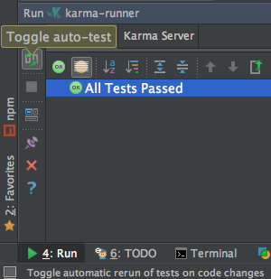
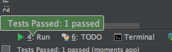
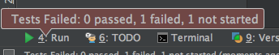

**UPD**: статься обновлена **21.11.2015**. Старое имя утилиты - [Testacular](https://github.com/vojtajina/testacular/)

[Karma](http://karma-runner.github.io/) - инструмент на **node.js**, позволяющий запускать **JavaScript** код в нескольких браузерах, нацеленная на поддержку **TDD** подхода.

**Karma** - это не фреймворк/библиотека для тестирования, поэтому совместно можно использовать:

- [Mocha](http://visionmedia.github.com/mocha/)
- [Jasmine](http://pivotal.github.com/jasmine/)
- [QUnit](http://qunitjs.com/)
- либо же что-то совсем другое, но написав свой адаптер

**Браузеры**, которые можно использовать:

- [Chrome and Chrome Canary](https://github.com/karma-runner/karma-chrome-launcher) (npm install karma-chrome-launcher)
- [Firefox](https://github.com/karma-runner/karma-firefox-launcher) (npm install karma-firefox-launcher)
- [Safari](https://github.com/karma-runner/karma-safari-launcher) (npm install karma-safari-launcher)
- [PhantomJS](https://github.com/karma-runner/karma-phantomjs-launcher) (npm install karma-phantomjs-launcher)
- [Opera](https://github.com/karma-runner/karma-opera-launcher) (npm install karma-opera-launcher)
- [IE](https://github.com/karma-runner/karma-ie-launcher) (npm install karma-ie-launcher)
- [SauceLabs](https://github.com/karma-runner/karma-sauce-launcher) (npm install karma-sauce-launcher)
- [BrowserStack](https://github.com/karma-runner/karma-browserstack-launcher) (npm install karma-browserstack-launcher)
- [и многие другие](https://www.npmjs.org/browse/keyword/karma-launcher)

## Установка:

$ npm install -g karma

Проверяем что все установилось:

$ karma --version

Так же нам понадобиться тест фреймворк, используем Jasmine:

npm install karma-jasmine

и подключение к браузеру(возьмем Chrome):

npm install karma-chrome-launcher

## Настройка:

Все настройки можно задать в [конфигурационном файле](https://raw.githubusercontent.com/vojtajina/karma/master/test/client/karma.conf.js). Мы можем создать свой файл настроек воспользовавшись мастером инициализации:

$ karma init

Разберем основные моменты **karma.config.js**:

//в скобках указано значение по умолчанию
basePath('') -
files(\[\]) - список файлов/шаблонов для загрузки
exclude(\[\]) - список исключений для предыдущего пункта
reporters(\['progress'\]) - вариант вывода прогресса
port(8080) - порт веб-сервера(testacular)
runnerPort(9100) - порт клиента
colors(true) - включение/выключение цветов при выводе
logLevel(LOG\_INFO) - LOG\_DISABLE|LOG\_ERROR|LOG\_WARN|LOG\_INFO|LOG\_DEBUG
autoWatch(false) - выполнение тестов при изменении файлов
browsers(\[\]) - Chrome, ChromeCanary, Firefox, Opera, Safari, PhantomJS
captureTimeout(5000) - задание таймаута в миллисекундах
singleRun(false) - для одноразового запуска
preprocessors({}) - список обработчиков, которые будут применены к файлам, до загрузки в браузер, например - CoffeeScript

Итак, у файл настроек есть, теперь можем запускать утилиту:

$ karma start

Т.к. мы еще не добавили сами тесты, то должно вывести что-то типа:

Executed 0 of 0 ERROR (0.006 secs / 0 secs)

Давайте создадим простой тест (на **Jasmine**):

describe("A suite", function() {
    it("contains spec with an expectation", function() {
        expect(true).toBe(true);
    });
});

сохраним его в файл **test.js** и подключим этот файл в конфиг:

files: \[
  'test.js'
\],

после чего снова запустим karma и посмотрим в консоль:

Executed 1 of 1 SUCCESS (0.086 secs / 0.002 secs)

Как видим: тесты прошли успешно, один тест выполнился.

##  Подключение в WebStorm

**UPD**: WebStrom начиная с версии 7 уже добавили поддержку Karma, поэтому не нужно уже выполнять танцы с бубном и настройкой [node debug](http://blog.jetbrains.com/webide/2011/11/webstorm-your-node-app/), который были до этого.

Заходим в настройки запуска и отладки:

Добавляем карму:

 

Из настроек вам нужно только задать имя и убедиться что подхватился правильный путь к файлу конфигурации.

Если мы хотим выполнять тесты после каждого изменения в коде, включим вот эту опцию:

Теперь webstorm будет нас информировать о состоянии тестов, в том числе в бекграунде:

то есть если мы сделаем TDD или просто хотим знать момент, когда мы что-то пошло не так, это довольно удобно:

