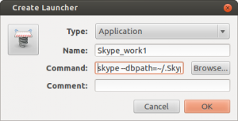

Порой бывает очень удобно создавать несколько skype-аккаунтов и список контактов, чтобы не смешивать друзей и работу. Я так и делал: на работе был запущен аккаунт с заказчиками и сотрудниками, а дома - друзья. Т.е. одного запущенного клиента вполне хватало. Но после того, как на работе добавился еще отдельный корпоративный скайп, появилась необходимость в одновременном запуске сразу двух. Для тех, кто хочет знать как это организовать довольно просто на Ubuntu, прошу под кат.

Для начала для каждого скайпа мы должны создать свою директорию(**профиль**), для этого клонируем существующий 2 раза:

$ cp -r ~/.Skype ~/.Skype.first
$ cp -r ~/.Skype ~/.Skype.second

убедимся что у нас есть  **gnome-panel**, если нет - ставим:

$ sudo apt-get install --no-install-recommends gnome-panel

Теперь подумаем куда мы хотим создать "ярлычок" загрузки, напирмер это будет директория **myapps**, если таковой не существует делаем:

$ mkdir myapps

а теперь создадим туда сам ярлычок:

$ gnome-desktop-item-edit ~/myapps/ --create-new

должно появится следующее диалоговое окно:

- Type - оставляем без изменений
- Name - произвольно
- Command - вносим **skype --dbpath=~/.Skype.first**

После нажатие ОК - у нас появился файл-загрузчик одного из наших скайп аккаунтов. Теперь повторив шаги сделаем второй, только для второго укажем:

- Command - вносим **skype --dbpath=~/.Skype.second**

Итого у нас получилось 2 загрузчика. Теперь можем их смело добавлять в автозапуск и перегружаться.
