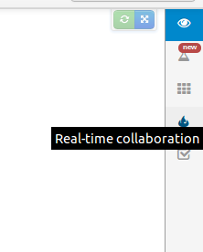

[Plunker](http://plnkr.co/) - сервис, для совместной работы над JavaScript кодом. Но в отличии от того же [jsfiddle](http://jsfiddle.net/), он позволяет просматривать правки кода в режиме реального времени, а в отличии [collabedit](http://collabedit.com/) - выполнять код.

Есть удобная авторизация через **github**. Да и сам проект из себя представляет [open-source](https://github.com/filearts/plunker).  Дальше, я так понял, проект планирует развить социальную соствляющую: пользователи, теги, обсуждения. На данный момент уже можно посмотреть разработки других людей, но пока еще нет поиска по коду.

Для тех кто не понял как запустить многопользовательское редактирование в режиме реального времени - заходим под кат.

Справа есть иконки находим среди них:

после нажатия у вас должна измениться ссылка (добавится параметр), после чего эту ссылку можно будет рассылать тому, с кем необходимо его вместе редактировать.
