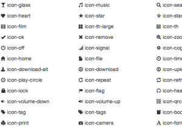

Много кто использует **CSS** от [bootstrap](http://twitter.github.com/bootstrap/index.html), но мало кто встроеный [набор иконок](http://twitter.github.com/bootstrap/base-css.html#icons). Это довольно удобно.

UPD: Также в тему [Font Awesome](http://fortawesome.github.com/Font-Awesome/).
