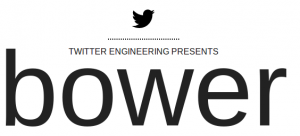

> Currently, people are managing dependencies, such as JavaScript libraries, manually. This sucks.

Крупные проекты как правило используют большое количество сторонних библиотек, таких как **jQuery**, **Underscore**, различные **UI** и плагины к ним, **компонентные фреймворки** и шаблоны к ним. Так вот, хранить весь этот сторонний код вместе с проектом не очень удобно. А, если еще учесть, что каждая библиотека должна иметь хотя бы 2 файла: минифицированый и отладочный, то структура проекта превращается в свалку, в которой уже довольно трудно разобраться. Да, частично решают вопрос git-ссылки репозитрия (когда мы не копируем контент, а ставим ссылку на репозиторий библиотеки), но это все равно не очень удобно. Хотелось бы совсем избавиться от этого стороннего кода в репозитории. Вот для этого и нужен **[bower](https://twitter.github.com/bower/)**.

По сути, вместо всех этих сторонних библиотек с помощью **bower** мы можем хранить в репозитории только инструкцию по их загрузке и потом при разворачивании проекта выполнить команду, которая подтянет все необходимые файлы к нам.

**Bower** написан на javascript для платформы **node.js**.

Устанавливается через **npm**:

npm install bower -g

После установки можно выполнить простую команду (в директории проекта):

bower install jquery

которая подгрузит к нам библиотеку jquery в ./components/jquery (по умолчанию)

Устанавливать библиотеки (пакеты) можно через:

- имя -
    
    bower install jquery
    
- ссылка на git-репозиторий (полная)
    
    bower install git://github.com/components/jquery.git
    
- ссылка на git-репозиторий (относительная)
    
    bower install components/jquery
    
- http ссылка на файл
    
    bower install https://foo.com/jquery.awesome-plugin.js
    
- локальный путь
    
    bower install ./repos/jquery
    

Причем в случае, если это будет ссылка на **архив**, - **bower** сам распакует его содержимое.

Если нужна конкретная версия библиотеки, то это можно задать с помощью тега:

bower install jquery#1.8.1
bower install git://github.com/components/jquery.git#~1.8.1
bower install components/jquery#1.8.x

Кроме команды **install**, есть также команда **update**.

Для поиска по готовым пакетам существуют команды **list** и **search**. Также можно воспользоваться [вот этим](https://sindresorhus.com/bower-components/) онлайн инструментом.

Теперь перейдем к самой интересной части - составлению конфиг файла для проекта, который подтянет все зависимости одной командой

bower install

Для этого в диретории проекта необходимо создать файл **component.json**, который по своей сути чем-то напоминает **package.json**(для **npm**), со следующим содержанием:

{
 "name": "myProject",
 "version": "1.0.0",
 "dependencies": { "jquery": "~1.7.2" }
}

где **name** и **version** просто поля описательного характера, а вот параметр **dependencies** - основаная часть, в которой будем описывать все библиотеки для загрузки. В нашем случае это **jQuery** с указанием версии.

Еще есть никому не ясная опция **main**, которая подразумевает указание одного главного файла каждого типа(css, html, js) и которую разработчики заложили на будущее.

В реальном проекте блок зависимостей может выглядеть как-то так:

{
  "angular-bootstrap": "0.1.0",
  "angular-complete": "1.0.4",
 "angular-ui": "0.4.0",
 "chosen": "0.9.11",
 "lodash": "1.0.0-rc.3"
}

также хочу обратить ваше внимание на то, что **bower** понимает вложенные зависимости. Если вы устанавливаете какой-то модуль, который зависит от **jQuery**, то нет необходимости отдельно прописывать установку **jQuery**, так как **bower** сам поймет что данную библиотеку необходимо установить.

Также можно добавлять свои пакеты(библиотеки) в репозиторий **bower**. Делается это следующей командой:

bower register myawesomepackagename git://github.com/maccmans/face

_ т.е. указывается название пакета и путь к нему.

После чего вашу библиотеку можно будет также установить с помощью bower:

bower install myawesomepackagename

Если вас не полностью удовлетворяет стандартный функционал, который можно задать конфиг файлом, - то можете воспользоваться прекрасным набором **bower** **api** методов и расширить инструментарий.

var bower = require('bower');
bower.commands
     .install(paths, options)
     .on('end', function (data) {
    data && console.log(data);
});

Все команды вызывают 3 типа событий: **data**, **end**, и **error**. Для **install** еще вызывается специальное событие **package**, которое говорит о том, что пакет был установлен.

Сам bower также имеет конфигурационный файл **.bowerrc** (не путать с файлом конфигурации компонент проекта - **component.json**). Также составлен в json формате и в нем мы можем задать следующие настройки:

{
"directory" : "components",
"json" : "component.json",
"endpoint" : "https://bower.herokuapp.com"
}

где

- **directory** - директория, куда будут загружается компоненты
- **json** - файл конфигурации компонент
- **endpoint** - позволяет запустить собственный Bower сервер-хранилище компонент

Если что-то еще осталось не ясно - задавайте вопросы - дополню пост.

**UPD**: Начиная с версии 0.9 **component.json** переименовали **bower.json**.

Материалы, которые вдохновляли на написание данной статьи:

- [Оф сайт Bower](https://twitter.github.com/bower)
- [Meet Bower: A Package Manager For The Web](https://net.tutsplus.com/tutorials/tools-and-tips/meet-bower-a-package-manager-for-the-web/ "nice article by Andrew Burgess")
- [Док файл, в котором идет доработка и обсуждедие спецификации Bower](https://docs.google.com/document/d/1APq7oA9tNao1UYWyOm8dKqlRP2blVkROYLZ2fLIjtWc)
