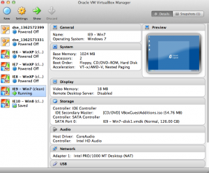

Хочу поделиться [скриптом](https://github.com/xdissent/ievms/blob/master/ievms.sh) найденым в сети, который создает виртуальные машины(на основе **VirtualBox**) для всех версий **Internet Explorer** на раздых **Windows**, при этом не нарушая лицензии. Подробности под катом.

Компания **Microsoft** сама создала [образы вируальных машин](http://www.microsoft.com/en-us/download/details.aspx?id=11575) с целью предоставляения возможности вебразработчикам тестировать их сайты на старых версиях **IE** и/или из другой операционной ситемы(**Linux/Mac**). Для удобного использования [Greg Thornton](Greg Thornton) создал [скрипт](https://github.com/xdissent/ievms), который сам все скачивает и устанавливает.

Плюсы: это бесплатно, легально и это не требует лиценизии на каждую Window.

Минусы: если вы захотите поставить себе все версии(это опционально), то займет довольно много места на диске (около 45Гб)

Внимание! Windows обязательно попросит себя активировать. Это нормально. Чтобы снова получить trial необходимо выполнить c правами администратора следующую команду в командной строке(cmd):

slmgr -rearm

Пароль по умолчанию для всех версий Windows - "_Password1_".

Запустить скрипт одной сточкой можно так:

curl -s https://raw.github.com/xdissent/ievms/master/ievms.sh | bash

через параметр **IEVMS\_VERSIONS** можно указать конкретные версии, которые необходимо установить

curl -s https://raw.github.com/xdissent/ievms/master/ievms.sh | IEVMS\_VERSIONS="6 8" bash

Спасибо Грегу за скрипт и вам успешного тестирования.
