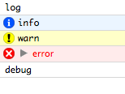
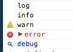
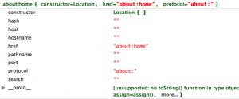
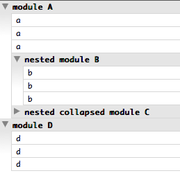
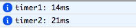
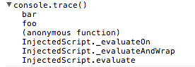

Речь пойдет о начинке встроенного объекта **console** в браузерах **Chrome** и **Firefox**.

Начнем с простого - метод **console.log**(). Базовый синтаксис:

```javascript
console.log(obj1 [, obj2, ..., objN);
console.log(msg [, subst1, ..., substN);
```

Если с первым вариантом использования все понятно, то со вторым следует разобраться: в данном случае мы можем использовать шаблон первым параметром, в который будут подставлены переменные, пример:

```javascript
console.log("%s is %d years old.", "Bob", 42)
```

и выведет оно, как вы уже догадались: _Bob is 42 years old._

Для подстановки можно использовать следующие подшаблоны:

- **%o** - для ссылки на объект
- **%d**, **%i** - целые чила (integer)
- **%s** - строки
- **%f** - числа с плавающей запятой (float)

Далее перейдем к схожим методам, а именно **console.info()**, **console.warn()**, **console.error()**, **console.debug()**. Все они работают аналогично **console.log()**, а метод **console.debug()** вообще является его алисом(deprecated). Отличие по сути только в варианте вывода(примеры для FireFox и Chrome):



 

Иногда, когда объект вложеный удобнее использовать не **console.log()**, а **console.dir()**, который выведет все в виде структуры:

```javascript
console.log(location)
console.dir(location)
```



чтобы вывести красиво HTML/XML можно использовать **console.dirxml()**:

```javascript
console.dirxml(document.body)
```

правда, если говорить о **Chrome**, то там объединили понятие **dir/dirxml** и **log** и для сложных обектов со вложенными свойствами используют **dir**/dirxml**** вместо **log** по умолчанию.

Если в консоль выводится много информации, то будет полезно разделять информацию по группам исползуя метод **console.group()** плюс вспомогательные **console.groupEnd()** и **console.groupCollapsed()**:

```javascript
console.clear()
console.group("module A")
console.log('a')
console.log('a')
console.log('a')
console.group("nested module B")
console.log('b')
console.log('b')
console.log('b')
console.groupEnd()
console.groupCollapsed("nested collapsed module C")
console.log('c')
console.log('c')
console.log('c')
console.groupEnd()
console.groupEnd()
console.group("module D")
console.log('d')
console.log('d')
console.log('d')
console.groupEnd()
```



Лично мне кажется, что группировка реализована не совсем удобно: нельзя записывать данные в несколько групп паралельно, т.е. пока одна группа не закрыта - мы пишем в нее.

Для оценки времени выполнения чего-либо существует удобный метод **console.time()** и **console.timeEnd()**, синтаксис:

```javascript
console.time(timerName);

console.timeEnd(timerName);
```

Пример:

```javascript
console.time("timer1")
console.time("timer2")
var i = 10000, j = 0;
while(i--){ j++}
console.timeEnd("timer1")
while(j--){}
console.timeEnd("timer2")
```



Есть также в консоли и метод для трассировки вызова - **console.trace()**. Наиболее полезное примененеие ему - вывод полного стека вызовов при возникновении ошибки - что делает браузер по умолчанию, но всеже, если мы переопределили стандартное поведение браузера, нам очень поможет этот метод:

```javascript
(function foo() {
  function bar() { console.trace(); };
  bar();
})()
```

К сожалению, в FireBug это не работает, а Chrome выдал следующее:



Через консоль еще можно проверять ожидаемые значения используя метод **console.assert()**, который в случае невыполнения условия внутри вернет **console.error()**.

Для работы с **DOM** есть ряд полезных хелперов:

- **$(), $$()** - краткая запись для document.querySelector
- **$x()** - получение элемента по XPath
- **$0** - выбранный инспектором элемент
- **$1** - предыдущий выбранный инспектором элемент
- **$n()** - показать один из пяти последних выбранных элементов (параметром идет номер элемента) - работает только для **FireBug**

Другие полезные хелперы:

- **keys()** - выводит ключи объекта
- **values()** - выводи значения объекта
- **inspect()** - открывает объект для инспектирования
- **clear()** - очищает консоль

Ну и конечно самый главный метод **help()**, плохо что его так и не реализовали в **Chrome**, но в **FireBug** он работает отлично, рекомендую.

 

Ну и еще как **бонус**, для тех, кто долистал этот посто до конца. В **FireBug** есть интересный синтаксис работы с переменными из замыкания используя "_%_":

```javascript
function Person(name)
{
    this.introduce = function()
    {
        return 'Hello, my name is ' + name;
    }
}

var someone = new Person("Arthur");
someone.%name; // выведет "Arthur"
```
 

Советую следить за обновлениями набора методов, так как бразуры постоянно совершенствуются и добавляют новые интересные плюшки.
