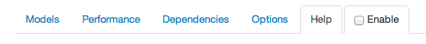

Если вы уже работаете с AngularJS, то наверняка заметили, что стандартные инструменты веб разработчика не предоставляют необходимую функциональность, иногда хочется чего-то более специализированного на конкретных особенностях фреймворка. И нам спешит на помощь расширение для **Chrome** - **[Angular Batarang](https://chrome.google.com/webstore/detail/angularjs-batarang/ighdmehidhipcmcojjgiloacoafjmpfk)**.

Инструмент еще достаточно сырой, сами авторы этого не скрывают: "_We are releasing this early version because we'd love to get your feedback. Let us know what you think and what we should add or improve in the [AngularJS Google Group](https://groups.google.com/forum/?fromgroups#!forum/angular)."_ Но все же уже можно начинать пробовать на вкус.

Итак что же нам дает использование **Batarang'a**?

После установки у вас должна появиться новая вкладка в панели инструментов разработчика. 

Перейдя по ней, вы увидите 4 функциональные вкладки: **Models**, **Performance**, **Dependencies**, **Options**; вкладку помощи и еще одну вкладку активации расширения (_зачем это было сделано в виде вкладки не совсем ясно_)

Убедившись, что мы находимся на странице нашего **AngularJS** приложения, активируем **Batarang** (_жмем галочку **Enable**_) - что вызовет перегрузку страницы приложения и инструмент начнет инспектирование и сбор информации.

Теперь давайте посмотрим на вкладки подробнее.

## Models

В данной вкладке мы видим дерево скоупов(**scopes**), с прикрепленными к ним данными. Первый скоуп в дереве - **rootScope**. При клике на ссылку конкретного скоупа справа отобразятся его данные. Если кликнуть на значок **<**, то перейдем на конкретный элемент DOM(режим инспектора элементов), с которым связан скоуп.

При наличии нескольких атрибутов **ng-app** можно выбрать какое дерево отображать.

В одной из последний версий расширения добавилась кнопка \[**Enable Inspector**\]. Назначение ее мне пока еще не совсем понятно.

 

## Performance

В данной вкладке фактически дублируется дерево скоупов, только теперь представлена информация о том, какие выражения(**expressions**) подключены к каким скоупам. Ссылка toggle используется для сворачивания подэлементов (сразу видно что продукт разрабатывался программистами и специалисты по юзабилити пока к этому руку не приложили)

Справа можно заметить сравнение производительности всех выражений приложения. информация обновляется динамически.

 

## Dependencies

Вкладка зависимостей визуализует зависимости сущностей/сервисов приложения. Наведя мышкой на один из сервисов можно увидеть подсвеченные зависимости выбранного сервиса: сервисы, которые зависят от выбранного подсвечиваются **зеленым**, сервисы от которых зависит выбранный сервис - **красным**.

Исходя из того, много ли в вашем приложении сервисов и зависимостей между ними, схема может быть как простая, так и довольно сложная:

 

## Options

Вкладка опций, где можно включить **отображение** (по сути отрисовывание цветной рамки по контуру) **приложений**(если их несколько на странице), **скоупов** и связываний(**bindings**). Для каждой сущности свой цвет: зеленый, красный и синий соответственно.

Также на этой вкладке выводится информация о версии Ангулара и использовании [CDN](https://ru.wikipedia.org/wiki/Content_Delivery_Network "wiki").

 

Какие еще плюшки?

Первая - дополнительная секция **AngularJS Properties** в инспекторе элементов, которая отображает Ангулар свойства

 

Вторая - дополнение объекта консоли(**console**) переменной **$scope**, которая является ссылкой на активный скоуп. Если не один скоуп не выбран - то она будет являтся ссылкой на **$rootScope**.

То есть довольно удобный доступ к данным скоупа, а также возможность обновления(**$scope.$apply()**) и выполнения других действий по отладке приложения.

 

 

Презентационное видео от разработчиков:

<iframe src="//www.youtube.com/embed/q-7mhcHXSfM" frameborder="0" width="560" height="315"></iframe>
