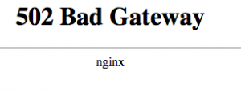

5 июля 2013 года популярный сервис онлайн музыки [prostopleer.com](https://prostopleer.com/) перестал быть доступен. Мне, думаю как и всем постоянным слушателям интернет плеера, стало интересно что же произошло. Пошел копать интернеты.

Информации практически нет, все поисковые результаты ссылались на какие-то прошлые проблемы DDOS-атак и временных сбоев на сервисе.

Копаем дальше...

Проанализируем: из 3 доменных имен (_prostopleer.com, prostopleer.ru, prostopleer.net_) на текущий момент на DNS запрос отвечает только на одно - **prostopleer.net**. Перейдя по нему внезапно получаем редирект на [pleer.com](https://pleer.com/). Где находим старый добрый сервис. Который по прежнему хостится на российских серверах.

**UPD [16.01.2014]**: Снова упал, правда в этот раз только веб-сервер(nginx).

