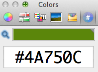

Simple and useful [ColorPicker application](https://www.robinwood.com/Catalog/Technical/OtherTuts/MacColorPicker/ColorPicker.zip) plus [hex-plugin](https://wafflesoftware.net/hexpicker/) (installation: just unpack and copy to  ~/Library/ColorPickers/)
