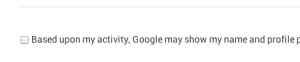

As far as you probably already know google [has changed personal content using policies](https://www.google.com.ua/intl/en/policies/terms/changes/). So now by default you agree that your all information about your "likes" and reviews will appear with your personal picture.

But at least for current moment it's possible to switch off it in your [personal account settings](https://plus.google.com/settings/endorsements).  Just remove mark from checkbox:

