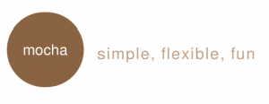

[Mocha](http://visionmedia.github.com/mocha/) - JavaScript тест-фреймворк, который можно запускать как на node.js, так и в браузере, удобен для асинхронного тестирования.

\* Правильное произношение слова: "_мока_".

## Установка

Достаточно выполнить следующую команду

$ npm install -g mocha

Проверяем установку

$ mocha --version
1.14.0

## Простой пример

По умолчанию **Mocha** запускает тесты из директории **test**, поэтому создадим такую директорию, а в ней **test.js**:

var assert = require("assert")
     describe('#indexOf()', function(){
         it('should return -1 when the value is not present', function(){
             assert.equal(-1, \[1,2,3\].indexOf(5));
             assert.equal(-1, \[1,2,3\].indexOf(0));
}) })

Теперь выполним

$ mocha test
1 passing (3ms)

## Синтаксис

В базовом синтаксисе тестов на Mocha все стандартно: начинаются с **describe();**, сами тесты в **it();** , которые находятся внутри **describe()**. Также, в случае большого количества блоков, мы можем группировать **describe()** друг в друга.

Так же доступны хуки: **before()**, **after()**, **beforeEach()**, и **afterEach()**. Хуки так же должны быть описаны внутри блока **describe()**.

 

## Asset библиотеки

Mocha позволяет использовать на выбор библиотеку/стиль для сравнений:

- [should.js](https://github.com/visionmedia/should.js) BDD style
- [expect.js](https://github.com/LearnBoost/expect.js)
- [chai](http://chaijs.com/) expect(), assert() and should style assertions
- [better-assert](https://github.com/visionmedia/better-assert)

 

## Асинхронные тесты

Идея ассинхронных тестов на mocha заключается в том, что мы передаем дополнительный callback-параметр **done**, который выполняем в случае успешного прохождения:

describe('User#save()', function(){
    it('should save without error', function(done){
         var user = new User('Luna');
         user.save(function(){
            done();
         });
    })
})

Все хуки ( **before()**, **after()**, **beforeEach()**, **afterEach()** ) также поддерживают асинхронную модель поведения:

beforeEach(function(done){
       db.clear(function(){
         done();
})})

 

## Логирование

Поддерживается стандартный метод **console.log()**, который выведет параметр на экран консоли при запуске тестов.

 

## Постоянное выполнение тестов

Можно запускать **Mocha** как одноразово, так и в режиме постоянного тестирования в ожидании изменений. Для второго варианта указываем флажок **watch**:

$ mocha --watch

 

## Генераторы отчетов

Mocha богат в выборе стиле отчетов:

- Dot Matrix - по умолчанию
- Spec
- Nyan
- TAP
- Landing Strip
- List
- Progress
- JSON
- JSON Stream
- JSONCov
- HTMLCov
- Min
- Doc
- XUnit
- TeamCity
- Markdown
- HTML

Чтобы задать конкретный стиль при запуске тестов используем параметр **reporter**:

$ mocha --reporter list

 

## Запуск в браузере

**Mocha** можно запустить и в браузере, для этого необходимо подключить скрипт стилей и указать какой интерфейс вы хотите использовать и потом запускать тесты.

<html>
<head>
<link rel="stylesheet" href="mocha.css" />
</head>
<body>

 
</body>
</html>

 

В своем проекте мы использовали связку **mocha** + **chai.expect**. и запускали через **[karma](http://karma-runner.github.io/0.10/index.html)**.
