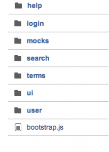
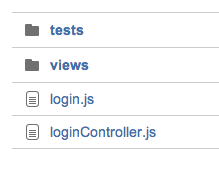

Буду рад, если этот пост сэкономит кому-то пару-тройку часов.

После нескольких проб и ошибок мы пришли в итоге к довольно таки удобной структуре проекта, когда весь код разбит на полноценные независимые модули, которые в себе содержат контролеры, директивы, сервисы, вьюхи, а также тесты конкретного модуля.

Многие в своих проектах делают разделение не модульное, а по типам сущностей ( conroller, directive, service). Мы этот вариант уже проработали и пришли к выводу что работать с такой структурой совсем не удобно.

Итого, в папочке app имеем:

 

и если взглянуть подробнее на внутренности модуля:

Один модуль определяем как основной(в нашем случае, у вас может быть по другому), в нем прописываем все общие настройки и ставим зависимость на остальные модули.
