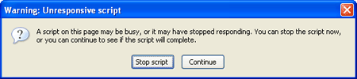

Да, в **JavaScript** тоже есть многопоточность(либо подобие) и реализована по средством инструмента **[Web Workers](https://www.w3.org/TR/workers/ "w3")**, о использовании которого и поговорим в данном посте.

Идея реализации: "тяжелые" операции, которые можно выполнять асинхронно(не блокирую работу браузера), выносятся в отдельные модули-файлы; это может быть: обработка большого количества данных, кеширование, проверка правописания, фильтрация изображений на canvas. В браузере для каждого такого файла создается объект **Worker**, по средством которого и осуществляется коммуникация.

Другими словами: используя технологию **Web Workers** можно избежать появления вот этого сообщения



## Проверка поддержки браузером

Для проверки поддерживает ли браузер технологию **Web Workers** достаточно проверить наличие объекта **window.Worker**:

```javascript
if (!!window.Worker)
{
    //поддерживается
}
```

##  Простой пример

На сайте [w3](https://www.w3.org/TR/workers/) дали довольно наглядный пример, который я немного модифицировал расширив передачу данных в обе стороны. Итак, у нас есть 2 файла: основной(для простоты пишем внутри хтмл файла) **test.html** и файл воркера **worker.js**. Мы задались целью выводить на экран [простые числа](https://ru.wikipedia.org/wiki/%D0%9F%D1%80%D0%BE%D1%81%D1%82%D0%BE%D0%B5_%D1%87%D0%B8%D1%81%D0%BB%D0%BE) в заданном диапозоне, но, так как операция по определению является ли число простым довольно ресурсоемкая, особенно для больших чисел, мы вынесем ее в отдельный фоновый поток (**worker**). Код этой функции и будет находиться в файле **worker.js**.

Итого, **test.html**:

```html
<!DOCTYPE HTML>
<html>
<body>
<output id="result"></output>
<script>
    var worker = new Worker('worker.js');
    worker.onmessage = function (event) {
        document.getElementById('result').textContent += ', ' + event.data;
    };
    worker.postMessage({from:17,to:50});
</script>
</body>
</html>
```

и файл **worker.js**:

```javascript
onmessage = function(event)
{
    var n = event.data.from;
    while (n < event.data.to) {
        n += 1;
        if(isPrime(n)){
            // found a prime!
            postMessage(n);
        }
    }
};

function isPrime(number){
    for (var i = 2; i <= Math.sqrt(number); i += 1){
        if (number % i == 0){
            return false;
        }
    }
    return true;
}
```

Для тех,  кто хочет поиграться с примером, - пожалуйста [сюда](https://learn.javascript.ru/play/DJ8n1b).

Теперь немного комментариев.

```javascript
var worker = new Worker('worker.js');
```

создаем объект Worker. Объект не запускается до полной загрузки и выполнения файла. Если путь к объекту Worker возвращает ошибку 404, его выполнение прекращается без уведомлений.

```javascript
worker.onmessage = function (event) {
```    

прописываем колбэк, который выполнится при вызове метода **postMessage** внутри воркера

```javascript
worker.postMessage({from:17,to:50});
```

отправляем в воркер сообщение с параметрами диапазона ( мы хотим получить все простые числа в диапозоне с 17 до 50 )

Перейдем к коду воркера:

```javascript
onmessage = function(event){
```

функция будет вызвана, при обращении к метод **worker.postMessage()** в основном скрипте

```javascript
var n = event.data.from;
```

доступ к данным внутри метода можно получить через **event.data**

 

## Взаимодействие  с объектами Worker

Как уже было показано на примере, взаимодействие с воркерами осуществляется путем потоковой передачи сообщений (метод **postMessage** - для отправки и колбэк **onmessage** - для приема).

Колбэк на получение сообщения можно также навешивать следующим способом:

```javascript
addEventListener('message', function(e) {
```

именно он является рекомендуемым для использования.

 

## Ограничения Web Worker

К чему **можно** обращаться внутри **worker**\-скрипта:

- Объект `navigator`
- Объект `location` (только чтение)
- `XMLHttpRequest`
- `setTimeout()/clearTimeout()` и `setInterval()/clearInterval()`
- [Кэш приложений](https://www.html5rocks.com/tutorials/appcache/beginner/)
- Импорт внешних скриптов с использованием метода `importScripts()`
- [Создание других объектов Web Worker](https://www.html5rocks.com/ru/tutorials/workers/basics/#toc-enviornment-subworkers)

У **worker**\-скрипта **нет доступа** к:

- Модель DOM (она не ориентирована на многопоточное исполнение)
- Объект `window`
- Объект `document`
- Объект `parent`

Методы **postMessage** и **onmessage** являются глобальными для ворвера, и к ним можно обратиться как на прямую, так и через **this** и **self**.

Максимальное количество workerов - **256**, после чего стек переполняется и пишет ошибку:

```
Maximum number of Web Worker instances(256) exceeded for this window.
```

 

## Отлов ошибок

Также, как и с сообщениями, мы можем подписаться на получение ошибок:

```javascript
 worker.addEventListener('error', onError, false);
```
 

## Динамическое создание worker-скриптов

Иногда возникает необходимо создать **worker**\-скрипт динамически(!внимание именно **worker**\-скрипт, а не сам **worker**), в зависимости от различных условий. В таком случае создание **worker** из отдельного файла нас не устраивает и мы должны воспользоваться вторым способом - через подготовленный объект [Blob](https://dev.w3.org/2009/dap/file-system/file-writer.html#the-blobbuilder-interface), а точнее - ссылки на него.

Вот так это будет выглядеть в коде

```javascript
var script = "onmessage = function(e) { postMessage('msg from worker'); }";
var blob = new Blob([script]);
var blobURL = window.URL.createObjectURL(blob);
var worker = new Worker(blobURL);
```

Для удобства скрипт изначально пожно записать в script тег:

```html
<script id="worker1" type="javascript/worker">
    //...код вашего воркера
</script>
```

а потом получить содержимое:

```javascript
var script = document.querySelector('#worker1').textContent;
```

!Внимание: не забудьте поставить тип **javascript/worker**, это предотвратит разбор кода js-движком браузера.

 

## Литература

- [Using web workers](https://developer.mozilla.org/en-US/docs/Web/Guide/Performance/Using_web_workers "MDN")
- [The Basics of Web Workers](https://www.html5rocks.com/en/tutorials/workers/basics/) ( и [русский перевод](https://www.html5rocks.com/ru/tutorials/workers/basics/), который, к сожалению, не обновляется)
- [Introduction to HTML5 Web Workers: The JavaScript Multi-threading Approach](https://msdn.microsoft.com/en-us/hh549259.aspx "msdn")
- [Web Workers](https://msdn.microsoft.com/en-us/library/ie/hh673568(v=vs.85).aspx "Internet Explorer Dev Center") 

_К сожалению, примеров, которые бы показались мне интересными, не нашел. Сам сейчас работаю над более продвинутой версией получения больших простых чисел._
