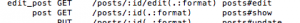

**Rails** -— фреймворк для построения веб-приложений, который основан на архитектуре MVC, ориентирован на быстрое написание кода(не производительность). Сервером может быть **Apache** или **nginx** с модулем **Phusion Passenger**. В качестве СУБД можно использовать **MySQL**, **PostgreSQL**, **SQLite**, **Oracle** и прочие.

Пост, который поможет за несколько шагов развернуть простой проект на **ruby on rails** без знания **ruby**. Без претензии на новизну либо подробное рассмотрение деталей(внимание: те, кто уже знаком с **Ruby** либо **Rails**, могут сильно плеваться).

## Установка Ruby

Для невиндовых операционных систем я предлагаю установку через [RVM](https://rvm.io/ "rvm"):

$ \\curl -sSL https://get.rvm.io | bash -s stable

а затем:

$ rvm install ruby

\* также тут можно указать какую версию(по умолчанию - последняя) поставить, например:

$ rvm install ruby-1.9.3-p484

Для пользователей Windows остается довольствоваться [RubyInstaller](https://rubyinstaller.org/ "Ruby Installer").

Проверим установился ли руби:

$ ruby --version

 

## Пробуем Ruby

Чтобы поиграться с руби можно запустить [irb](https://ru.wikipedia.org/wiki/Interactive_Ruby_Shell "ruby shell") - командную оболочку, для выполнения кода из консоли

$ irb

и попробовать что-то такое

\> "somestring".reverse

Если о самом **Ruby** представления нет, то желательно пройти какой-то крайткий курс по синтаксису, например [TryRuby](https://tryruby.org/ "try ruby").

## Установка Rails

$ gem install rails

Проверяем

$ rails -v

## Выбор среды для разработки на Ruby on Rails

полноценные среды разработки:

- [Aptana RadRails](https://www.aptana.com/products/radrails "radrails")
- [RubyMine](https://www.jetbrains.com/ruby/ "rubyMine") (платный)
- [Netbeans](https://netbeans.org/ "netbeans")

текстовые редакторы с подсветкой кода:

- [TextMate](https://macromates.com/)
- [SublimeText](https://www.sublimetext.com/ "SublimeText")
- Vim (с плагинами и оболочками)

## Создание структуры проекта на Rails

Для разбора зададимся целью написать простейший блог.

Сгенерировать структуру проекта нам поможет команда( в рабочей директории)

$ rails new blog

_blog_ - название вашего проекта.

После, мы увидим новую директорию с первоначальной структурой.

Посмотреть все возможные настройки так:

$ rails new -h

Разберем более подробно структуру каталогов

app/

главный каталог, включает модели, представления, контроллеры и помощники

config/

файлы конфигурации

db/

управления базой данных: схема базы данных и миграции

doc/

документация

lib/

дополнительные библиотеки

log/

логи

public/

единственная папка, видимая для пользователей; содержит картинки, стили, статические html странички

script/rails

Скрипт Rails для генерации кода, открытия консоли сессий, или запуск локального веб-сервера

test/

Юнит-тесты

tmp/

Временные файлы

vendor/

Сторонний код, например плагины и гемы

README.rdoc

инструкции к проекту

Rakefile

Описание задач выполняемых в командной строке (команда rake)

Gemfile

Gem требования для приложения, используется Bundler

config.ru

Файл конфигурации для Rack middleware

.gitignore

стандартный файл git- инструкций (список файлов, которые должны быть проигнорированы Git)

## Запуск Rails сервера

Чтобы вывести в браузере наш проект, нам необходим веб-сервер. Стартуем:

Переходим в папку нашего проекта:

$ cd blog

выполняем команду запуска сервера:

$ rails server

Теперь можем открыть [http://localhost:3000](http://localhost:3000/) и увидеть следующее содержимое:

## Создаем controller и action

Для создания контроллера _welcome_ и экшена _index_ в нем, нам достаточно выполнить одну команду:

$ rails generate controller welcome index

это создаст для нас не только файл контроллера, но также шаблон представления, файл тестов, вспомогательные статические файлы и пропишет новую инструкцию в маршруты(route).

Теперь можем открыть в редакторе новый шаблон

app/views/welcome/index.html.erb

 и отредактировать его по своему усмотрению, например написать

<h1>Hello, Rails!</h1>

Теперь, если мы перейдем по адресу [https://127.0.0.1:3000/welcome/index](https://127.0.0.1:3000/welcome/index), мы увидим нашу страничку.

## Вносим изменения в route конфигурацию

Предположим что мы захотели чтобы наша страничка выводилась по умолчанию. Для этого открываем файл **config/routes.rb**. Находим строчку

\# root :to => 'welcome#index'

и раскомментируем ее. Тем самым указав что наш корневой путь будет ссылаться на

'welcome#index'

также удалим статическую страничку, она нам больше не нужна:

$ rm public/index.html

и теперь зайдем на  [https://127.0.0.1:3000](https://127.0.0.1:3000/welcome/index) (сервер перегружать при этом не нужно) и должны увидеть нашу страничку.

Если выполнить команду

$ rake routes

то можно увидеть список всех роутов:

welcome_index GET /welcome/index(.:format) welcome#index
      root     /                        welcome#index

## Добавляем ресурс

Ресурс (**resourse**) в терминологии **Rails** - это коллекция объектов, над которыми можно выполнять **CRUD** операции.

Чтобы добавить путь в роутах для нового ресурса достаточно написать resources :%resourseName%, т.е. в нашем примере добавим строчку:

resources :posts

в **config/routes.rb**.

Пероверим роуты уже знакомой командой:

$ rake routes
welcome_index GET    /welcome/index(.:format)  welcome#index
posts GET    /posts(.:format)          posts#index
POST   /posts(.:format)          posts#create
new_post GET    /posts/new(.:format)      posts#new
edit_post GET    /posts/:id/edit(.:format) posts#edit
post GET    /posts/:id(.:format)      posts#show
PUT    /posts/:id(.:format)      posts#update
DELETE /posts/:id(.:format)      posts#destroy
root        /                         welcome#index

как видим этой одной строчкой мы задали инструкции для всех CRUD путей.

Добавим контроллер для нашего ресурса:

$ rails g controller posts index

команда создаст файл app/controllers/posts_controller.rb

Теперь можем перейти на созданный index-экшен - [http://localhost:3000/posts](http://localhost:3000/posts)

Созданим экшен для добавления нового поста: для этого перейдем в файл posts-контроллера - app/controllers/posts_controller.rb и пропишем там новый метод _new_:

def new
end

Теперь можем попробовать перейти на [http://localhost:3000/posts/new](http://localhost:3000/posts/new)

И получить сообщение об ошибке:

которая нам говорит о том, что мы еще не создали шаблон представления для этого экшена. Создалим его (app/views/posts/new.html.erb) с содержимым <h1>New Post</h1>.

Перейдем еще раз на [http://localhost:3000/posts/new](http://localhost:3000/posts/new) и увидим уже наш контент:

## Работа с представлением(view)

Итак у нас есть страничка для создания поста, добавим к ней форму. Для этого используем form_for хелпер(вспомогательный метод для представления), получим:

<%= form_for :post, url: posts_path do |f| %>
  

    <%= f.label :title %> 
    <%= f.text_field :title %>
  

  

    <%= f.label :text %> 
    <%= f.text_area :text %>
  

  

    <%= f.submit %>
  

<% end %>

Перейдем на  [http://localhost:3000/posts/new](http://localhost:3000/posts/new) и увидим нашу формочку:

Вот [тут](https://rusrails.ru/rails-form-helpers)можно почитать о форм-хелперах более подробно. Единственно что хочу разъяснить "posts_path" - это ссылка на путь /posts. Rails отправляет данные формы POST запросом, поэтому мы попадем на posts#create в роутерах:

Осталось создать экшен create в контроллере posts, так же как и для new создаем новый метод, итого получим контроллер

class PostsController < ApplicationController
  def index
  end

  def new
  end

  def create
    render text: params[:post].inspect
  end
end

с 3мя методами. Экшн _create_ содержит в себе метод _render_, который принимает параметр с ключем '_text_' и значением '_params[:post].inspect_'.

Теперь, если отправить форму, мы увидим значение заполненных полей.

## Создание моделей

Имя **Rails-модели** в единственном числе, а соответствующая ей таблица в базе данных - во множественном. Для создания модели _Post_ со свойствами _title_ и _text_ выполним команду:

$ rails generate model Post title:string text:text

после чего будет создано несколько файлов: модель, файл тестов и файл инструкций для обновления базы

**Связывание модели с базой данный**

Файл инструкций для обноления базы уже был создан в предыдущем шаге. Нам остается только запустить команду миграции:

$ rake db:migrate

которая создаст для нас таблицу Posts.

\* Настройки базы данных лежат **config/database.yml**

## Сохранение данных модели в базу

Теперь перепишем на метод create так, чтобы он сохранял данные в базу:

  def create
    @post = Post.new(params[:post])  #создаем модель и наполняем данными формы

    @post.save    # сохраняем модель
    redirect_to @post    #переадресовываем на страницу отображения поста
  end

## Вывод данных

По умолчанию для вывода модели используется экшн _show_, что можно проверить опять же такие командой _rake routes_:

Создадим в нашем контроллере данный метод:

  def show
    @post = Post.find(params[:id])
  end

который получит данные по :id. Не забудем так же создать вьюху (_app/views/posts/show.html.erb_):

  <strong>Title:</strong>
  <%= @post.title %>

  <strong>Text:</strong>
  <%= @post.text %>

Еще раз попробуйте добавить новый пост [http://localhost:3000/posts/new](http://localhost:3000/posts/new)

Поработаем над выводом всех сообщений. Для этого отредактируем index шаблон (_app/views/posts/index.html.erb_):

<h1>Listing posts</h1>

<table>
  <tr>
    <th>Title</th>
    <th>Text</th>
  </tr>

  <% @posts.each do |post| %>
      <tr>
        <td><%= post.title %></td>
        <td><%= post.text %></td>
      </tr>
  <% end %>
</table>

И добавим получение данных в экшен-метод:

  def index
    @posts = Post.all
  end

Перейдя на [http://localhost:3000/posts/](http://localhost:3000/posts/) мы должны увидеть все посты.

Добавим ссылки: с главной странички(шаблон _app/views/welcome/index.html.erb_) на страничку постов:

<%= link_to "My Blog", controller: "posts" %>

со странички постов на создание нового:

<%= link_to 'New post', new_post_path %>

ссылку "Назад" для странички нового поста и просмотра поста:

<%= link_to 'Back', posts_path %>

Как вы уже могли обратить внимание мы использовали **link_to** вью-хелпер. Более подробно о нем [RTFM](https://api.rubyonrails.org/classes/ActionView/Helpers/UrlHelper.html "Rails Api").

## Обновление данных

Мы уже разобрали как создавать данные и выводить их. Теперь поговорим об обновлении даных модели.

Добавляем edit экшен в наш контроллер:

  def edit
    @post = Post.find(params[:id])
  end

в котором будет только получение информации, и шаблон для него (app/views/posts/edit.html.erb):

<h1>Editing post</h1>

<%= form_for :post, url: post_path(@post), method: :patch do |f| %>
    <% if @post.errors.any? %>
        

          <h2><%= pluralize(@post.errors.count, "error") %> prohibited
            this post from being saved:</h2>
          <ul>
            <% @post.errors.full_messages.each do |msg| %>
                <li><%= msg %></li>
            <% end %>
          </ul>
        

    <% end %>
    

      <%= f.label :title %> 
      <%= f.text_field :title %>
    

    

      <%= f.label :text %> 
      <%= f.text_area :text %>
    

    

      <%= f.submit %>
    

<% end %>

<%= link_to 'Back', posts_path %>

Теперь для сохранения информации добавим update экшн:

  def update
    @post = Post.find(params[:id])

    if @post.update(params[:post])
      redirect_to @post
    else
      render 'edit'
    end
  end

и добавим ссылку на редактирование при выводе постов:

   <td><%= link_to 'Show', post %></td>
   <td><%= link_to 'Edit', edit_post_path(post) %></td>

## Удаление данных

Добавим экшн-метод удаления поста:

def destroy
    @post = Post.find(params[:id])
    @post.destroy

    redirect_to posts_path
  end

и ссылочку для удаления на страницу вывода всех постов

<td><%= link_to 'Destroy', post_path(post),
           method: :delete, data: { confirm: 'Are you sure?' } %></td>

Обратите внимание что мы передаем данные методом DELETE, и запрашиваем подтверждение на выполнение действия (в нашем случае это удаление)

Страничка теперь выглядит так:

## Создание партиалов представления

Для уменьшения количества html-кода, общие фрагменты выносятся в так назвываемые вью-партиалы(partial). В нашем случае это формочка, которая используется для создания поста, а также для его редактирования. Вынесем ее в отдельный шаблон(_app/views/posts/_form.html.erb_):

<%= form_for @post do |f| %>
    <% if @post.errors.any? %>
        

          <h2><%= pluralize(@post.errors.count, "error") %> prohibited
            this post from being saved:</h2>
          <ul>
            <% @post.errors.full_messages.each do |msg| %>
                <li><%= msg %></li>
            <% end %>
          </ul>
        

    <% end %>
    

      <%= f.label :title %> 
      <%= f.text_field :title %>
    

    

      <%= f.label :text %> 
      <%= f.text_area :text %>
    

    

      <%= f.submit %>
    

<% end %>

Чтобы подключить наш вью-партиал необходимо добавить строчку:

<%= render 'form' %>

Так и сделаем с _new_ и _edit_ шаблонами.

Для начала это все.

Валидация, добавление комментариев к постам и авторизация во второй части.

Пост является переосмыслением и компиляцией статьи [Getting Started with Rails](https://guides.rubyonrails.org/getting_started.html) и ее [русского перевода](https://rusrails.ru/getting-started-with-rails).
