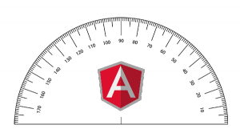

**[Protractor](https://github.com/angular/protractor)** - **e2e** тест-фреймворк сделанный на основе [WebDriverJS](https://code.google.com/p/selenium/wiki/WebDriverJs), который приходит на смену первоначальным e2e тестам **AngularJS**. Запускает тесты в реальном браузере. Может быть запущен как самостоятельный бинарник либо включен в тесты как библиотека.

## Установка

Для установки достаточно установить npm-пакет:

```
$ npm install -g protractor
```

проверим все ли прошло успешно:

```
$ protractor --version
Version 0.18.1
```

чтобы установить и запустить **Selenium**, который будет выполнять тесты для нас делаем:

```
$ webdriver-manager update
```

а потом

```
$ webdriver-manager start
```

## Запуск

Для запуска **протрактора** делаем:

```
$ protractor protractor.js
```

где _protractor.js_ - предварительно созданный нами файл конфигурации.

Для старта можно использовать конфиг из [примера](https://raw.github.com/angular/protractor/master/example/conf.js "protractor example config"):

```javascript
// An example configuration file.
exports.config = {
  // The address of a running selenium server.
  seleniumAddress: 'http://localhost:4444/wd/hub',

  // Capabilities to be passed to the webdriver instance.
  capabilities: {
    'browserName': 'chrome'
  },

  // Spec patterns are relative to the current working directly when
  // protractor is called.
  specs: ['example_spec.js'],

  // Options to be passed to Jasmine-node.
  jasmineNodeOpts: {
    showColors: true,
    defaultTimeoutInterval: 30000
  }
};
```

Единственно что вам нужно изменить это опцию _specs_(по умолчанию ['example_spec.js']). В ней мы укажем путь к файлу(либо группе файлов) тест-сценария. Давайте создадим его также по [примеру](https://github.com/angular/protractor/blob/master/example/example_spec.js):

```javascript
describe('angularjs homepage', function() {
  it('should greet the named user', function() {
    browser.get('https://www.angularjs.org');
    element(by.model('yourName')).sendKeys('Julie');
    var greeting = element(by.binding('yourName'));
    expect(greeting.getText()).toEqual('Hello Julie!');
  });
});
```

Из описания видно что наш тест:

- зайдет на страницу https://www.angularjs.org
- выберет елемент связанный с моделью _yourName_ и установит значение _'Julie'_
- выберет элемент по связке(bind) с моделью _yourName_
- проверит что текст приветствия равен _'Hello Julie!'_

Теперь запустим:

```
$ protractor protractor.js
Using the selenium server at http://localhost:4444/wd/hub
.

Finished in 5.629 seconds
1 test, 1 assertion, 0 failures
```

## Настройка

Все возможный варианты параметров конфигурации описаны в [этом](https://github.com/angular/protractor/blob/master/example/conf.js) примере.

Разберем некоторые

| Опция | Описание | Значение по умолчанию |
|-------|----------|-----------------------|
| seleniumAddress | адрес запущенного селениум сервера (обычно http://localhost:4444/wd/hub) | null |
| allScriptsTimeout | таймаут для выполнения всех сценариев | 11000 |
| specs | пути к файлам сценариев тестов (относительно конфига) | ['spec/\*_spec.js'] |
| exclude | исключения для предыдущего пункта | [] |
| capabilities | выбор браузера с параметрами. Более подробно [тут](https://code.google.com/p/selenium/wiki/DesiredCapabilities) | {'browserName': 'chrome'} |
| multiCapabilities | предыдущая опция для запуска тестов в нескольких браузерах | [] |
| baseUrl | стартовая страница приложения | http://localhost:8000 |
| rootElement | элемент на котором иницилизированно приложение (ng-app) | body |
| onPrepare | колбэк который будет выполнен, когда протрактор готов к работе, но тесты еще не начали выполняться | function() {} |
| params | параметры, которые будут внедрены в среду выполнения тестов (но не сами тесты) | {login: { user: 'Jane', password: '1234'}}, |
| framework | фреймворк для тестов. возможные варианты: jasmine, cucumber, mocha | jasmine |
| onCleanUp | колбэк, когда тесты завершены | function(){} |


## Написание тестов

По умолчанию используется [Jasmine](https://pivotal.github.io/jasmine/) фреймворк, но при желании его можно поменять на [mocha](https://mochajs.org/)(инструкции [тут](https://angular.github.io/protractor/#/frameworks "angular.github.io/protractor") ).

Глобальные переменные, которые добавляет **протрактор**:

- **protractor** - нэймспэйс-оболочка протрактора, которая содержит статические вспомогательные переменный и классы
- **browser** - оболочка вебдрайвера, используется для навигации и получение информации о странице
- **element** - вспомогательная функция для нахождения и взаимодействия с элементами
- **by** - коллекция стратегий поиска элементов (ccs selector, id, binding attribute)

Основные методы-помошники:

- browser.**get**(targetUrl) - переход на указанный URL
- element(**by.css**('.error')) - выбор элемента по css
- element(**by.model**('modelName')) - выбор элемента по модели
- element(**by.binding**('variableName')) - выбор элемента по баиндингу (_ng-bind_ или _{{variableName}}_)
- element.**all**(**by.repeater**('item in items')); - выбор списка элементов из ngRepeat
- element(by.model('modelName')).**getText**() - получение текстового значения
- element(by.model('modelName')).**getAttribute**('id') - получение значение аттрибута
- element(by.model('modelName')).**sendKeys**('Some text') - задание значения
- element.all(by.repeater('item in items')).**count**() - получение количества элементов в списке
- element.all(by.repeater('item in items')).**get**(1) - получение одного элемента из списка
- element.all(by.repeater('item in items')).**first**() - получение первого элемента из списка
- element.all(by.repeater('item in items')).**last**() - получение последнего элемента из списка
- element.all(by.repeater('item in items')).**row**(1).**column**('title') - получение значение title из 2й строки
- **browser**.**isElementPresent**(by.model('modelName')) - проверка наличия элемента
- **$**('.info') - короткий алиас к **element**(**by.css**('.info'))   !Внимание: не путать с **jQuery**.
- **$$**('option') - короткий алиас к **element.all**(**by.css**('option'))

## Тестирование асинхронных операций

Учитавая что ваше приложение скорее всего подгружает большое количество контента асинхронно, то повозится со спецификой прийдется прилично.

Воздержусь от подробного разбора данного пункта, так как в зависимости от выбранной библиотеки подходы в написании тестов могут отличатся. Единственное что скажу: сразу для себя настроил **[mocha](https://mochajs.org/ "mocha test framework")**_фреймворк, с ним намного удобнее работать с асинхронными операциями.

## Создание снимков экрана

Вебдрайвер позволяет делать скриншоты с помощью метода **browser.takeScreenshot()**, который возвращает промис, который в свою очередь вернет **PNG**  снимок экрана в формате **base64**:

```javascript
browser.takeScreenshot().then(function (png) {
 //...
}
```

Для записи файла на диск можно написат свою вспомогательную функцию:

```javascript
var fs = require('fs');
function writeScreenShot(data, filename) {
  var stream = fs.createWriteStream(filename);
  stream.write(new Buffer(data, 'base64'));
  stream.end();
}
```

и потом ее вызвать:

```javascript
browser.takeScreenshot().then(function (png) {
    writeScreenShot(png, 'test_screen.png');
}
```

**!Внимание:** в некоторых случаях необходимо дождаться полной загрузки страницы (или отдельного компонента) чтобы не получить частичный снимой недогруженного контента.

## Отладка(debugging) сценариев Protractor

Функциональные(end to end) тесты крайне сложно дебажить, потому что они зависят от системы в целом, также могут зависеть от предыдущих действий (например логин), и могут изменять состояние приложения, которое тестируют. В частности отладку тестов на вебдрайвере(webdriver) усложняют длинные соообщения об ошибках и разделение процессов: на тот, который выполняется в браузере, и тот, который выполняет сам тест сценарий.

Возможные причины остановки:

- вебдрайвер выдает ошибку, когда команда не может быть завершена, например: элемент не найден
- **protractor** останавливается, когда не может найти **AngularJs**. Если необходимо проверять так же страницы без AngularJs, тогда используйте вебдрайвер напрямую через browser.driver

Чтобы поставить точку остановки (**debug point**) необходимо в коде теста вызвать следующий метод:

```javascript
browser.debugger();
```

и запустить **protractor** в режиме отладки(с флагом **debug**):

$ protractor debug protractor.js

И после чего вы сможете насладиться радостью дебага из консоли

```
debug> help
Commands: run (r), cont (c), next (n), step (s), out (o), backtrace (bt), setBreakpoint (sb), clearBreakpoint (cb),
watch, unwatch, watchers, repl, restart, kill, list, scripts, breakOnException, breakpoints, version
debug>
```

Используется [node-debugger](https://nodejs.org/api/debugger.html), только точка остановки задается методом _browser.debugger()_; вмето _debugger;_

## Интерактивный запуск

Альтернативный способ отладки - интерактивный запуск, когда вы можете сами выполнить команды сценария из консоли и обнаружить ошибку.

Для запуска **protractor** в режиме консоли необходимо выполнить следующую команду в директории программы:

```
$ node ./bin/elementexplorer.js
```

(в зависимости от ОС и типа установки путь к директории программы может отличаться. В моем случае это было _/usr/local/lib/node_modules/protractor/_)

Теперь можно  выполнить что-то типа такого:

```
$ browser.get('https://www.angularjs.org')
```

или просто

```
$ browser
```

## Дополнительно

Что можно еще интересного почитать в тему:

- [Advanced Testing and Debugging in AngularJS](https://www.yearofmoo.com/2013/09/advanced-testing-and-debugging-in-angularjs.html)
- [Advanced Protractor features](https://eitanp461.blogspot.nl/2014/01/advanced-protractor-features.html)

Приятных вам тестов с **Protractor**!
