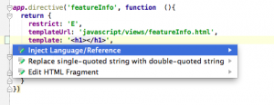
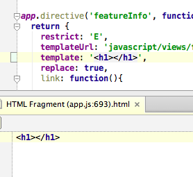

I just got known that **WebStorm** has such a nice possibility to **edit HTML** that is presented like a string (in JavaScript code) in separate window. All you need to do is press **[Alt]**+**[Enter]** and vuala:

