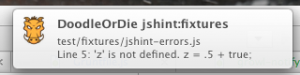

[grunt-notify](https://github.com/dylang/grunt-notify) - pretty useful **grunt** plugin that provides the adapter to **notification-manager** for your custom events. For example: you are doing TDD - it could inform you when tests-status switches from FAIL to SUCCESS or back. It is supported by all operational systems.
