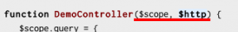

**[Dependency Injection](https://en.wikipedia.org/wiki/Dependency_injection "wiki")** - одна из парадигм на которых строиться **AngularJS**.

Давайте подумаем как вот этот синтаксис

можно превратить в **DI**, и выполнить внедрение _$scope_ и _$http_ (в данном случае).

Итак, поставим задачу в духе TTD:  у нас есть основная функция DemoController:

function DemoController($scope, $log){
  $log($scope.someVariable);
}

и вероятно еще 2 функции-конструкторы для объектов, которые будем внедрять:

function scopeProvider(){
  return { someVariable: 'Some text'}
}

function logProvider(){
  return function(text){
    console.log.apply(console,arguments);
  }
}

Теперь мы должны написать такую функцию **invoke**, используя которую можно будет выполнить

invoke('DemoController');

Первое что приходит в голову - получить функцию ввиде строки(**toString**), а потом достать из нее параметры регуляркой.

Получить метод по имени можно через объект, в котором он опеределен. В нашем случае это глобальный объект window:

var fn = window[functionName];

получаем описание функции в виде строки:

var fnText = fn.toString();

вырезаем из нее аргументы и записываем в массив:

var args = fnText.slice(fnText.indexOf('(') + 1, fnText.indexOf(')')).match(/([^\\s,]+)/g);

итого имеем в _args:_

["$scope", "$log"]

пройдемся по ним циклом, создадим экземпляр класса провайдера для каждого и запишем в массив:

args.forEach(function(arg){
  var providerName = arg.replace('$', '') + 'Provider';
  injectors.push(new window[providerName]);
})

ну и теперь осталось только выполнить наш метод с этими параметрами:

fn.apply(window, injectors);

Весь метод:

function invoke(functionName){
	var fn = window[functionName],
      fnText = fn.toString(),
      args,
      injectors = [];

  args = fnText.slice(fnText.indexOf('(') + 1, fnText.indexOf(')')).match(/([^\\s,]+)/g);

  args.forEach(function(arg){
    var providerName = arg.replace('$', '') + 'Provider';
    injectors.push(new window[providerName]);
  })

  fn.apply(window, injectors);
}

invoke('DemoController');

Для одного уровня зависимостей этого достаточно, но что если мы захотим также добавить зависимости для _scopeProvider_ и _logProvider_? Получается мы рекурсивно должны пройтись по всем вложенным конструкторам.

Итак добавим еще одну зависимость для scopeProvider:

function scopeProvider($dbAdapter){
 this.someVariable = $dbAdapter.getText();
}

function dbAdapterProvider(){
  this.getText = function(){
    return 'Some text'
  }
}

Попробуем пока без рекурсии добавить обработку еще одного уровня вложенности расширив метод invoke:

function invoke(functionName){
  var fn = window[functionName],
      args,
      injectors = [];

  args = parseArguments(fn.toString()) || [];

  args.forEach(function(arg){
    var providerName = arg.replace('$', '') + 'Provider',
    subfn = window[providerName],
    subargs = parseArguments(subfn.toString()) || [],
    subinjectors = [];

    subargs.forEach(function(subarg){
      var subproviderName = subarg.replace('$', '') + 'Provider';
      subinjectors.push(ObjectFactory(window[subproviderName]));
    });

    injectors.push(ObjectFactory(window[providerName], subinjectors));
  })

  fn.apply(window, injectors);
}

Прошу обратить внимание на ключевые моменты:

- регулярные выражения мы вынесли в отдельный метод _parseArguments_
- для динамического создания экземпляра класса мы использовали вспомогательный метод _ObjectFactory_

Содержание метода _ObjectFactory_:

function ObjectFactory(Constructor, args) {
    var Temp = function(){},
        inst, ret;

    Temp.prototype = Constructor.prototype;
    inst = new Temp;

    ret = Constructor.apply(inst, args);
    return Object(ret) === ret ? ret : inst;
}

Мы решили задачу, но опять у нас есть ограничение по уровню вложенности. Перед тем как переходить к рекурсивному решению еще немного упростим код:

function invoke(fn){
  var args= parseArguments(fn.toString()) || [],
  injectors = [];

  args.forEach(function(arg){
    var provider = getProviderMethod(arg);
    subargs = parseArguments(provider.toString()) || [];
    provider.injectors = [];

    subargs.forEach(function(subarg){
      provider.injectors.push(ObjectFactory(getProviderMethod(subarg)));
    });

    injectors.push(ObjectFactory(provider, provider.injectors));
  })

  fn.apply(window, injectors);
}

invoke(window['DemoController']);

что изменилось:

- теперь передаем параметром ссылку на саму функцию(а не название)
- получение метода провайдера вынесено в отдельную функцию _getProviderMethod_

Возьмемся за рекурсию:

function getInjectors(fn){

  if(!fn.length){
    //no injectors
    return [];
  }

  var args = parseArguments(fn.toString()) || [],
      injectors = [];

  args.forEach(function(arg){
    var provider = getProviderMethod(arg);
    injectors.push(ObjectFactory(provider, getInjectors(provider)));
  })

  return injectors;
}

function invoke(fn){
  fn.apply(window, getInjectors(fn));
}

 

Вот так мы пришли к упрощенному варианту того, что внутри [angular.$injector](https://github.com/angular/angular.js/blob/v1.2.13/src/auto/injector.js "github").

Методы инжектора Angular и их аналог в нашем примере:

- **invoke** - _invoke_
- **instantiate** - _ObjectFactory_
- **get** -  _getProviderMethod_
- **annotate** - _getInjectors_

Плюс в полном варианте есть поддержка модулей, переопределение провайдеров, и описание DI-сущностей: **constant**, **value**, **provider**, **factory**, **service**, **decorator**.

Полный код примера на [gist](https://gist.github.com/stevermeister/9368235), [jsbin](https://jsbin.com/kiwis/1/edit?html,js,console,output).
