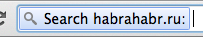

На хабре уже мелькала [статья](https://habrahabr.ru/post/218051/ "habrahabr.ru") в тему. Суть в том, что мы делаем поисковый запрос, используя поисковый механизм конкретного сайта, до перехода на сам сайт в адресной строке браузера.

Проще будет на примере. Мы хотим запустить поиск по хабру. Переходим в строку браузера и пишем "h" и далее пробел, и о чудо:

мы видим что мы уже ищем по хабру.

Как сделать это чудо? Оказывается в chrome-браузере(как и в Firefox) уже есть встроенная возможность создавать такие алиасы.

Для того, чтобы создать такой шорткат в chrome, открываем [chrome://settings/searchEngines](https://chrome//settings/searchEngines), затем добавляем новый поисковый движок **habr**, ключевое слово - **h**, ссылка с параметром -  **https://habrahabr.ru/search/?q=%s**. Вот и все.

Пробуем(в адресной строке браузера):

- h \[пробел\] angular
- h \[пробел\] рекурсия

Полезный набор шорткатов:

- **wiki** - Wikipedia - https://en.wikipedia.org/wiki/Special:Search?search=%s
- **tr** - google translate - https://translate.google.com/?source=osdd#auto|auto|%s
- **h** - habrahabr - https://habrahabr.ru/search/?q=%s
- **jq** -jQuery - https://jquery.com/%s
- **calendar** - google calendar - https://www.google.com/calendar
- **s** - Stackoverflow - https://stackoverflow.com/search?q=%s
- **вики** - Википедия - https://ru.wikipedia.org/wiki/Special:Search?search=%s
- **bug** - любимый баг трекер ( например для поиска по ID )
