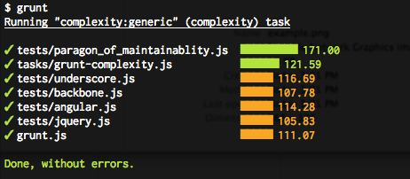

В добавок к валидации кода и покрытия юнит-тестами я прикрутил интересную штуку для проекта - **[grunt-complexity](https://github.com/vigetlabs/grunt-complexity)** - оценку сложности кода.

Установка - npm пакет:

$ npm install grunt-complexity

Конфигурирование в grunt-файле:

[javascript] complexity: { generic: { src: ['grunt.js', 'tasks/grunt-complexity.js'], options: { errorsOnly: false, cyclomatic: 3, halstead: 8, maintainability: 100 } } } [/javascript]

И запустив:

$ grunt complexity

Получим такую интересную картинку:

Теперь давайте разберем что же все таки такое **complexity** и из каких параметров она складывается.

## Строчки кода (Line of Code or LoC)

Это может быть либо физическое количество (строчек кода в файле) либо логическое (считаются только строчки с операторами)

## Количество парамтров (Number of Parameters)

Анализируется семантически(по описанию функции) и без учета использования **arguments**.

## Цикломатическая сложность (Cyclomatic Complexity)

Количество всевозможных проходов блока кода

## Цикломатическая плотность (Cyclomatic Complexity Density)

Отношение циклической сложности к логическому количеству строк кода

## Критерии сложности Хальстеда (Halstead Complexity Measurement)

Основывается на количестве операторов и операндов в конкретной функции. Выделяют 3 основных критерия: Difficulty, Volume, Effort, которые могут быть получены по следующим формулам:

Difficulty = (# distinct operators / 2) \* (# operands / # distinct operands)
Volume = (# operators + # operands) \* log2(# distinct operators + # distinct operands)
Effort = difficulty \* volume

## Индекс _поддержки_ (Maintainability Index)

Чтобы посчитать его мы должны использовать 3 уже описанные параметра:

 Maintainability =  171 - (3.42 \* ln(effort)) - (0.23 \* ln(cyclomatic complexity)) - (16.2 \* ln(logical LOC))

Исходя из этой формулы делаем вывод что индекс может иметь значение от минус бесконечности до **171**. И чем выше индекс - тем код более поддерживаемый.

С первого взгляда кажется более чем сложно, но в процессе работы, когда все делает одной командой, а еще лучше просто автоматизировано и выполняется вместе с тестами, - помогает найти слабыем места и вовремя их исправить.

Прошу прощения за очень вольный перевод терминов, если где-то неточность - поправьте пожалуйста.
