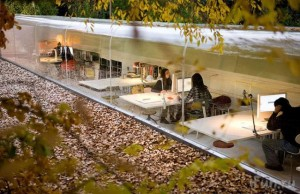

Нашел свой старый список заметок-хотелок относительно ИТ-компании. Нужно это не потерять, вдруг пригодится.

- экологически чистый район
- относительно высокое здание(а вообще хочу замок!)
- ИТ город
- велосипедные парковки
- нижние/подвал этажы - серверы, верхние - офисы
- тренажерный зал и столы для настольного тенниса, бильярдный стол
- фирменный стиль интерьера
- у каждого отдела свой стиль
- растения и цветы
- бассейн
- большая столовая и буфеты в каждом секторе
- опенспейс внутри отдела
- постоянно обновляющееся современное оборудование(лучше чем дома)
- эргономическая мебель
- выделение времени на свои проекты (возможно смежные с основной работой)
- использование новых технологий в проектах
- совместные командные командировки
- тренинги направленные на развитие профессиональных навыков
- свободный график

Если что-то важное/интересное не учел - говорите - с радостью дополню.
