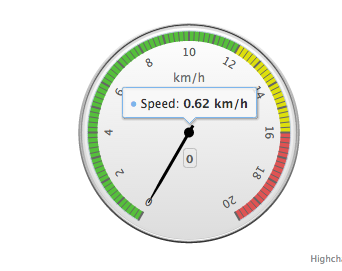

I decided to find use for [Highcharts](https://www.highcharts.com/) speedometer and got [Mousometer](https://stepansuvorov.com/useIt/mousometer/) that measures speed of you mouse moves, welcome to have fun with it.

You can find code [here](https://github.com/stevermeister/mousometer "github").
