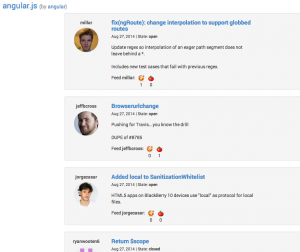

Let me introduce you my pet-project **[FeedTheDevs](https://feedthedevs.herokuapp.com/ "feedthedevs-app")**. It provides easy way to **estimate** (by voting ) each **PullRequest** to any **github** repo. Could be used like developer work evaluation.

Application was created using **AngularJS**, **node.js**, **PostgreSQL**, **GitHub API**. You can find source code [here](https://github.com/stevermeister/feedthedevs "github").

Why "feed"? For got PR you give developer pizza, otherwise you feed him with spoiled tomatoes :)
