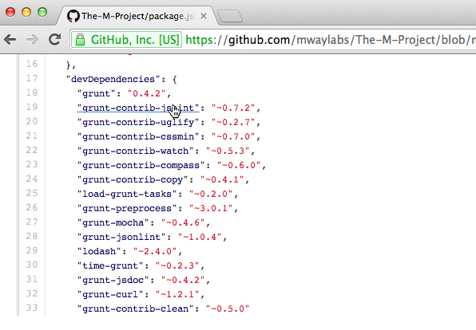

[GitHub Linker](https://chrome.google.com/webstore/detail/github-linker/jlmafbaeoofdegohdhinkhilhclaklkp "chrome.google.com") makes more convenient to browse threw all your **bower**, **npm** and **composer** project dependencies on github.
