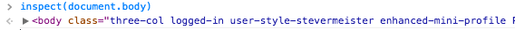
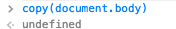

You could set the focus on element without pointing it via inspector, there is "**inspect**" method in **console** now:

one more helper-method in console is "**copy**" - to stringify and copy to clipboard:

after such operation you will have document.body element converted into string in your clipboard.

Some inspiration for start playing:

[javascript] inspect(document.body.firstChild) inspect(document.querySelector('div')) inspect(document.querySelector('.ng-scope')) inspect($1)

copy($0) copy(document.querySelectorAll('div')[0]) copy(document.cookie) [/javascript]
