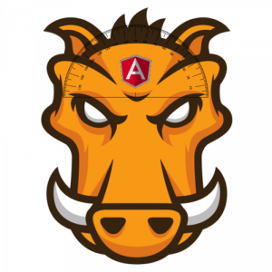
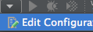
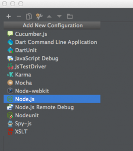
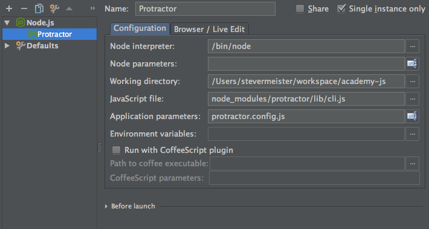
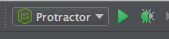

О том как установить и запустить **[Protractor](https://angular.github.io/protractor/#/ "angular.github.io/protractor")** уже было в этом посте - [Тестируем AngularJS используя Protractor](https://stepansuvorov.com/blog/2014/02/angularjs-protractor/ "angularjs-protractor"). А сейчас мы сделаем фокус  на том, как мы можем интегрировать **Protractor** в нашу систему и подкючить к **[Grunt](https://gruntjs.com/ "gruntjs")**.

## Подключаем Protractor к Grunt

Для подключение нам необходимо поставить специальный таск-плагин [grunt-protractor-runner](https://www.npmjs.org/package/grunt-protractor-runner "npmjs.org") к grunt путем выполнения следующей команды:

$ npm install grunt-protractor-runner

После чего можем дополнить наш конфигурационный файл секцией для него:

\[javascript\] protractor: { options: { configFile: "protractor.conf.js" }, all: {} } \[/javascript\]

**protractor.conf.js** - конфигурационный файл, который уже у нас есть (создание подробно описано в [предыдущем посте](https://stepansuvorov.com/blog/2014/02/angularjs-protractor/))

**all: {}** - grunt требует как минимум один "target", поэтому, если все параметры уже указаны в конфиге протрактора, то можем просто добавить пустую сецию.

Проверим что мы все правильно настроили и команда выполняется без ошибок:

\[bash\] $ grunt protractor:all \[/bash\]

## PhantomJS и Protractor

В случае, когда мы хотим запускать наши тесты не только локально, но и на сервере, где нет возможности использовать браузер на помощь спешит [PhantomJS](https://phantomjs.org/ "phantomjs.org"). Ознакомиться с **PhantomJS** вы можете в посте - [Создаем юнит-тесты с phantomjs](https://stepansuvorov.com/blog/2012/09/%D1%81%D0%BE%D0%B7%D0%B4%D0%B0%D0%B5%D0%BC-%D1%8E%D0%BD%D0%B8%D1%82-%D1%82%D0%B5%D1%81%D1%82%D1%8B-%D1%81-phantomjs/), а сейчас мы поговорим о том как его встроить в Protractor.

Теперь вместо вебдрайвера мы должны запустить фантом-сервер:

$ phantomjs --webdriver=4444

а наша секция grunt конфига преобразиться следующим образом:

\[javascript\] protractor: { options: { configFile: "protractor.conf.js" }, all: { options: { args:{ seleniumAddress: 'http://localhost:4444', capabilities: { browserName: 'phantomjs' } } } } } \[/javascript\]

иногда бывает необходимо специфицировать конкретную версию/путь к phantomjs, тогда добавляем еще одну опцию - **phantomjs.binary.path**, а аргументы к фантому можем передавать через опцию **phantomjs.cli.args**; итого получим:

\[javascript\] protractor: { options: { configFile: "protractor.conf.js" }, all: { options: { args:{ seleniumAddress: 'http://localhost:4444', capabilities: { browserName: 'phantomjs', 'phantomjs.binary.path':'./node\_modules/.bin/phantomjs', 'phantomjs.cli.args': \['--ignore-ssl-errors=true', '--web-security=false'\] } } } } } \[/javascript\]

Если мы хотим, чтобы вебдрайвер запустил фантом за нас, то просто не указываем параметр **seleniumAddress**.

## Отладка тест-сценариев в WebStorm

Пару слов о том как можно дебажить тесты в WebStorm. Что для этого нужно сделать:

Открываем настройки Run/Debug:

Добравляем новую конфигурацию для Node.js:

Прописываем следующие ключевые настройки:

- **Working directory**: корневой путь вашего проекта (например: ‘_/Users/stevermeister/workspace/academy-js_’)
- **JavaScript file**: путь к cli.js файлу протрактора (как правило это _node\_modules\\protractor\\lib\\cli.js_)
- **Application parameters**: путь к файлу конфиг файлу протрактора(например: _protractor.conf.js_)

Сохраняем. Готово:

Теперь можно проставлять бреймпоинты и дебажить.

## Подключение вспомогательных файлов

Иногда возникает необходимость подключить файлы, которые не являются тест сценариями, но, в которых содержится вспомогательный функционал(например логин). Для этого необходимо подключаем файл сделать формата модуля **node.js** ([module.exports](https://openmymind.net/2012/2/3/Node-Require-and-Exports/ "Node-Require-and-Exports")), то есть(helpers.js):

\[javascript\] function login(){ //... } function logout(){ //... } var Helper = {}; Helper.login = login; Helper.logout = logout; \[/javascript\]

и потом подключить в файле сценария:

\[javascript\] var helpers = require('./helpers'); helpers.login(); \[/javascript\]

Для тех, кто ранее не работал с таким синтаксисом, подчеркну: расширение "_.js_" в данном случае не пишется.

Примеры тест сценариев

## Авторизация пользователя в приложении:

\[javascript\] describe('Auth Module', function() { var ptor = protractor.getInstance();

it('should login user', function() { browser.get('/login'); browser.waitForAngular();

element(by.model('username')).sendKeys(browser.params.login.user); element(by.model('password')).sendKeys(browser.params.login.password); element.all(by.css('.button--primary')).first().click();

element(by.binding('user.name')).getText().then(function(username) { expect(username).equal(browser.params.login.username); }); ptor.getCurrentUrl().then(function(url) { expect(url.slice(-10)).equal('/dashboard'); }); }); }); \[/javascript\]

Параметры типа пароля в тестах, понятное дело лучше не держать. Здесь они вынесены в отдельную секцию конфига протрактора (да, согласен, тоже не комильфо, но всеравно лучше, чем прям в тестах):

\[javascript\] params: { login: { user: 'stepan@mail.com', password: 'XXXXXXXXX', username: 'Stepan Suvorov' } } \[/javascript\]

## Покупка продукта

\[javascript\] describe('Purchase item', function() { var ptor = protractor.getInstance();

beforeEach(function() { helpers.logout(); helpers.login(); browser.sleep(3000); });

it('should purchase an item', function() {

browser.get('/items/552/buy'); browser.sleep(3000); element(by.css('.modal-window\_\_block .button--primary')).click();

ptor.ignoreSynchronization = true;

element(by.css('#mainSubmit')).click(); element(by.css('input\[type="submit"\]')).click();

ptor.ignoreSynchronization = false; }); }); \[/javascript\]

хотел бы отметить очень важный момент в этом куске кода:

\[javascript\] ptor.ignoreSynchronization = true; \[/javascript\]

этим мы говорим протрактору, что мы покидаем приложение и переходим на страницу без AngularJS.

## Поиск по каталогу

\[javascript\] describe('Search', function() { it('should do search', function() {

browser.get('/items'); element(by.model('itemsSearch.query')).sendKeys('iBrick', protractor.Key.ENTER);

element.all(by.repeater('item in items')).then(function(rows) { var itemTitleElement = rows\[0\].element(by.className('item-tile\_\_name')); itemTitleElement.getText().then(function(itemTitle) { expect(itemTitle).equal('iBrick Plus'); })

}); }); }); \[/javascript\]

 

## Дополнительно

- [Protractor Interactive (видео от Egghead)](https://egghead.io/lessons/angularjs-protractor-interactive "egghead.io")
- [Развернутый ответ на стеке по поводу возможных ошибок](https://stackoverflow.com/a/25008031/274500 "stackoverflow.com")
