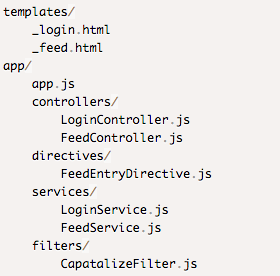
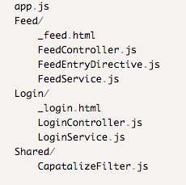
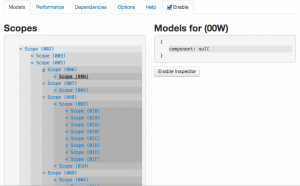
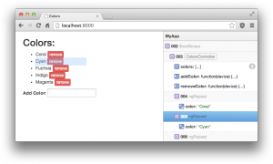

Пост представляет собой микс перевода/переработки статьи [The Top 10 Mistakes AngularJS Developers Make](https://www.airpair.com/angularjs/posts/top-10-mistakes-angularjs-developers-make) и личного [грабельного опыта](https://keddr.com/wp-content/uploads/2014/04/2830180.gif "хорошая иллюстрация").

## Введение

Думаю многие согласятся, что AngularJS один из самых популярных JavaScript фреймворков на сегодняшний день. Что делает его таким популярным? Наверное то, что он серьезно упрощает процесс разработки прототипов, и также позволяет расширять эти прототипы до полноценных многофункциональных приложений. Широкое распространение фрейворка привело в свою очередь к широкому распространению ошибок связанных с ним. Ниже приведен список самых часто встречаемых ошибок.

## 1\. "MVC" структура директорий проекта

AngularJS - грубо говоря MVC фреймворк: модели не так четко выделены как в Backbone, но архитектурный паттерн все же похож. Когда мы работаем в рамках MVC фремфорка, общая практика - группировать файлы основываясь на их типе, то есть:



Это выглядит как очевидный лэйаут, особенно если вы пришли откуда-то из Rails. Однако, как только приложение начинает расти, такое расположение приводит к тому, что много папок открыто одновременно. Чтобы бы вы не использовали Sublime, Visual Studio или Web Storm, много времени уходит на прокручивание дерева ресурсов. Вместо этого можно группировать файлы основываясь на фиче/модуле/предназначении:



Такая структура директорий делает поиск конкретного файла намного проще и соотвественно ускоряет разработку. В итоге для нашего проекта мы пришли к [вот такой](https://stepansuvorov.com/blog/2013/11/%D1%81%D1%82%D1%80%D1%83%D0%BA%D1%82%D1%83%D1%80%D0%B0-%D0%BD%D0%B0%D1%88%D0%B5%D0%B3%D0%BE-angularjs-%D0%BF%D1%80%D0%BE%D0%B5%D0%BA%D1%82%D0%B0/ "Структура нашего AngularJS проекта")модульной структуре.

## 2\. Модули (а точнее - их нехватка)

Обычно, когда вы начинаете делать прототип, вы все складываете в главный модуль, иногда даже просто в один файл, и это работает:

[javascript] var app = angular.module('app',[]);

app.service('MyService', function(){ //service code });

app.controller('MyCtrl', function($scope, MyService){ //controller code }); [/javascript]

В процессе разрастания приложения вы стараетесь уже группировать сущности с использованием модулей:

[javascript] var services = angular.module('services',[]); services.service('MyService', function(){ //service code });

var controllers = angular.module('controllers',['services']); controllers.controller('MyCtrl', function($scope, MyService){ //controller code });

var app = angular.module('app',['controllers', 'services']); [/javascript]

Как вы уже наверное обратили внимание: ошибка полностью аналогична ошибке с директориями. И правильным решением будет группировка по функциональному предназначению:

[javascript] var sharedServicesModule = angular.module('sharedServices',[]); sharedServices.service('NetworkService', function($http){}); var loginModule = angular.module('login',['sharedServices']); loginModule.service('loginService', function(NetworkService){}); loginModule.controller('loginCtrl', function($scope, loginService){});

var app = angular.module('app', ['sharedServices', 'login']); [/javascript]

и конечно, в большом приложении все это должно быть разнесено по отдельным файлам.

## 3\. Внедрение зависимостей (Dependency injection)

Dependency injection - один из лучших паттернов AngularJs. Он делает тестирование намного проще, на ряду с тем, что все зависимости становятся более понятно описаны. AngularJS очень гибок в плане того, как могут быть внедрены зависимоcти. Самый легкий способ: просто передать имя зависимости в функцию как параметр:

```javascript 
  app.controller('MainCtrl', function($scope, $timeout){ $timeout(function(){ console.log($scope); }, 1000); });  
 ```

_ вполне понятно, что **MainCtrl** зависит от **$scope** и **$timeout**. Это прекрасно работает до момента, когда вы захотите минифицировать код. Он может превратиться в что-то такое:

```javascript 
  var app=angular.module("app",[]);app.controller("MainCtrl",function(e,t){t(function(){console.log(e)},1e3)})  
 ```

После такой компиляции AngularJS уже не знает какие там были зависимости у **MainCtrl**. AngularJS предлагает довольно простое решение для данной проблемы: передавать зависимости как массив строк, а последним элементом в этом массиве будет функция принимающая эти параметры:

```javascript 
  app.controller('MainCtrl', ['$scope', '$timeout', function($scope, $timeout){ $timeout(function(){ console.log($scope); }, 1000); }]);<br /> 
 ```

в данном случае после компиляции получим:

```javascript 
  app.controller("MainCtrl",["$scope","$timeout",function(e,t){t(function(){console.log(e)},1e3)}])  
 ```

Так же эту проблему можно решить с помощью [ngAnnotate](https://github.com/olov/ng-annotate "github.com") модуля, который сам переведет ваш код в полную форму записи перед минификацией.

## 3.1 Глобальные зависимости

Часто при разработке на **AngularJS** возникает необходимость использования сторонних библиотек, которые в большей части представляют из себя глобальные объекты/функции (то есть доступны в любом месте кода). То, что мы можем их везде использовать не задумываясь о подключении, - это хорошо, но ломает паттерн ангуляра и ведет к ряду неприятных последствий при тестировании(и не только). AngularJS позволяет легко завернуть эти глобальные переменные в модули/сервисы и потом их подключать.

Например библиотека [Underscore.js](https://underscorejs.org/), которая существенно упрощает JavaScript код, может быть обернута в модуль/сервис следующим образом:

```javascript 
  var underscore = angular.module('underscore', []); underscore.factory('_', function($window) { return $window._; }); var app = angular.module('app', ['underscore']); app.controller('MainCtrl', ['$scope', '_', function($scope, _) { init = function() { _.keys($scope); } init(); }]);  
 ```

Это позволит сохранить структуру зависимостей AngularJS, и в дальнейшем мы сможем выгрузить(либо перегрузить) Underscore.js для тестов.

Может показаться, что это лишняя и ненужная работа, но если вы следуете "use strict" для всего вашего кода - данные изменения будут необходимы.

## 4\. Толстые котроллеры

Контроллеры - это стержень AngularJS приложения. Когда вы только начали работать с фреймворком, есть большое желание свалить всю логику туда. Но запомните: в контроллерах не должно быть манипуляций с DOM структурой - это то, что решается с помощью директив. Вся бизнес логика должна быть отдельно от котроллеров, а именно - в сервисах.

Данные также должны храниться в сервисах (за исключением тех случаев, когда это временные данных представления завязанные на **$scope**). Сервисы являются синглтонами и сохраняют свое значение на протяжении всей работы с приложением, а вот контроллеры могут перегружаться при изменении состояния. Если данные сохранены в контроллере, тогда они будут загружаться каждый раз при перезагрузке контроллера. Даже, если данные сохранены локально (например в **localStorage**), намного быстрее получить данные из JavaScript переменной.

## 5\. service или factory

Наличие в фреймворке одновременно **service** и **factory** может сбить с толку начинающих разработчиков. Но все должно стать на свои места, когда вы поймете, что это всего лишь [синтаксический сахар для провайдеров](https://stepansuvorov.com/blog/2013/03/angularjs-%D1%87%D0%B5%D0%BC-%D0%BE%D1%82%D0%BB%D0%B8%D1%87%D0%B0%D0%B5%D1%82%D1%81%D1%8F-provider-factory-%D0%B8-service/ "чем отличается provider, factory и service").

Так чем же все таки они отличаются? Суть скрывается в методе **$injector.instantiate**, благодаря которому инжектор создает новую сущность сервиса используя его функцию-конструктор.

Вот пример использования **service** и **factory**, которые делают одно и тоже:

[javascript] var app = angular.module('app',[]); app.service('helloWorldService', function(){ this.hello = function() { return "Hello World"; }; });

app.factory('helloWorldFactory', function(){ return { hello: function() { return "Hello World"; } } }); [/javascript]

При внедрении сущностей в обоих случаях мы получим в контроллере сущность, которая будет содержать метод _hello_(). Функция-конструктор для сервиса будет инициализирована один раз при объявлении, в том время как объект фабрики создается каждый раз при инжекте. Да, конечно, мы можем реализовать **service** так, что он будет вести себя как **factory**.

Так зачем нужны 2 способа? factory предполагает более гибкую настройку, чем service, потому что она может вернуть функцию-конструктор, которая будет использована для создания объекта (из [этого паттерна](https://ru.wikipedia.org/wiki/%D0%90%D0%B1%D1%81%D1%82%D1%80%D0%B0%D0%BA%D1%82%D0%BD%D0%B0%D1%8F_%D1%84%D0%B0%D0%B1%D1%80%D0%B8%D0%BA%D0%B0_%28%D1%88%D0%B0%D0%B1%D0%BB%D0%BE%D0%BD_%D0%BF%D1%80%D0%BE%D0%B5%D0%BA%D1%82%D0%B8%D1%80%D0%BE%D0%B2%D0%B0%D0%BD%D0%B8%D1%8F%29 "Абстрактная фабрика") вероятно и происходит название сущности).

```javascript 
  app.factory('helloFactory', function() { return function(name) { this.name = name; this.hello = function() { return "Hello " + this.name; }; }; });  
 ```

Вот пример использования такой фабрики в контроллере:

[javascript] app.controller('helloCtrl', function($scope, helloWorldService, helloWorldFactory, helloFactory) {

helloWorldService.hello(); //'Hello World' helloWorldFactory.hello(); //'Hello World' new helloFactory('Readers').hello() //'Hello Readers' }); [/javascript]

Другими словами: когда начинаете разрабатывать приложения на основе **AngularJS** и вам не нужен паттерн "фабрика", то просто используйте service.

Фабрика может пригодиться там, где у нас много приватных методов:

[javascript] app.factory('privateFactory', function(){ var privateFunc = function(name) { return name.split("").reverse().join(""); //reverses the name };

return { hello: function(name){ return "Hello " + privateFunc(name); } }; }); [/javascript]

этот пример иллюстрирует возможность наличия _privateFunc_ метода не доступного извне. Данный паттерн можно создать и с использованием сервисов, но фабрика делает его более очевидным.

## 6\. Игнорирование инструментов Batarang и ng-inspector

**[Batarang](https://chrome.google.com/webstore/detail/angularjs-batarang/ighdmehidhipcmcojjgiloacoafjmpfk?hl=en "chrome.google.com/webstore")** - расширение для Chrome браузера. Более подробно в [этом](https://stepansuvorov.com/blog/2013/07/angularjs-batarang/ "AngularJs Batarang") посте.



Основные возможности:

- просмотр модели **scope** (может быть полезно при работе с изолированным **scope**)
- граф зависимостей (например: для выявления перегруженных сущностей)
- аналитика производительности (для определения наиболее ресурсоемких операций)

**[ng-inspector](https://ng-inspector.org/)** - еще одно полезное расширение для Chrome (так же существует для Safari). Предоставляет удобный обзор структуры scope (что в Batarang сделано не самым лучшим образом).



## 7\. Слишком много вотчеров

Как было отмечено в предыдущем пункте: AngularJS довольно производительный уже "из коробки". Но когда число вотчеров превысит 2000, это может стать реальной проблемой. (Это собираются пофиксить в AngularJS 1.3, более подробно можно почитать [тут](https://www.aaron-gray.com/delaying-the-digest-cycle-in-angularjs/ "Delaying the $digest() cycle in Angularjs"))

Вот этот код покажет количество вотчеров на странице(можно быстро проверить в консоли):

[javascript] (function () { var root = $(document.getElementsByTagName('body')); var watchers = []; var f = function (element) { if (element.data().hasOwnProperty('$scope')) { angular.forEach(element.data().$scope.$$watchers, function (watcher) { watchers.push(watcher); }); }

angular.forEach(element.children(), function (childElement) { f($(childElement)); }); };

f(root); console.log(watchers.length);

})(); [/javascript]

Старайтесь выявлять места, где можно обойтись без дополнительных вотчеров. Помочь в этом может Batarang. Для тех случаев, когда нам не нужно двойное связывание, а необходимо просто вывести информацию в темплейт, можно использовать вспомогательный модуль [bindonce](https://github.com/Pasvaz/bindonce), который предоставляет специальные директивы - аналог ангуляровским, только без вотчеров.

## 8\. Путаница с наследованием $scope

Есть некоторые нюансы **прототипного наследования** (используемого в javascript), которые проявляются при работе со **$scope**, так как каждый **$scope** наследуется от родительского **$scope** и так далее до самого верхнего уровня **$rootScope**.

Благодаря прототипному наследованию передача данных из родительского скоупа в дочерний довольно проста, но тут есть далеко не очевидный момент. Допустим у нас есть _username_ отображаемый в панели навигации и он так же вводиться в форму логина, вот как это может быть реализовано:

```html 
  <div ng-controller="navCtrl"> <span>{{user}}</span> <div ng-controller="loginCtrl"> <span>{{user}}</span> <input ng-model="user"/> </div> </div>  
 ```

!Внимание вопрос: какие поля шаблона обновятся (когда юзер вводит текст)?

Если вы сразу же ответили "_только loginCtrl_", вероятно вы уже понимаете логику наследования. Поиграться с примером можно [тут](https://jsfiddle.net/STEVER/nu11ejnw "jsfiddle").

Суть в том, что примитивы передаются как значение, а объекты по ссылке. Поэтому, если мы хотим, чтобы обновилось также значение в котроллере navCtrl, то мы должны оперировать не значениями, а свойствами объектов, то есть вместо **user** мы запишем **user.name**:

```html 
  <div ng-controller="navCtrl"> <span>{{user.name}}</span> <div ng-controller="loginCtrl"> <span>{{user.name}}</span> <input ng-model="user.name"/> </div> </div>  
 ```

Пример [тут](https://jsfiddle.net/STEVER/6kf3ch6d/ "jsfiddle.net").

Может показаться, что пример надуман. Но это не так: даже, когда мы работаем с родными ангуляровами директивами, которые имеет свой скоуп, мы можем столкнуться с проблемой такого рода.

## 9\. Тестирование в ручную

Начинающие разработчики недооценивают силу **TDD** и проверяют весь проект при изменении в какой-то части (ну или не проверяют, тут уже от ответственности зависит). То же самое касается приложений на основе **AngularJS**. А если еще учесть тот факт, что AngularJS изначально разрабатывался как "хорошо тестируемый", а для тестирования в нашем распоряжения есть множество удобных инструментов.

2 самых полулярных тест-ранера это [**Karma**](https://karma-runner.github.io/0.12/index.html "karma-runner.github.io") и [**Protractor**](https://angular.github.io/protractor/#/ "angular.github.io/protractor"). **Karma** используется для юнит тестов, а **Protractor** - для функциональных/интеграционных с подключением Selenium и имитацией "реальных" действий пользователя в браузере.

Полезные посты по теме:

- [Karma(Testacular) в помощь тестированию](https://stepansuvorov.com/blog/2013/01/testacular-%D0%B2-%D0%BF%D0%BE%D0%BC%D0%BE%D1%89%D1%8C-%D1%82%D0%B5%D1%81%D1%82%D0%B8%D1%80%D0%BE%D0%B2%D0%B0%D0%BD%D0%B8%D1%8E/ "Testacular в помощь тестированию")
- [Тестируем AngularJS используя Protractor](https://stepansuvorov.com/blog/2014/02/angularjs-protractor/ "Тестируем AngularJS используя Protractor")
- [Автоматизируем тестирование AngularJS с Protractor](https://stepansuvorov.com/blog/2014/11/protractor/ "Автоматизируем тестирование AngularJS с Protractor")

 

## 10\. Использование jQuery

Просто прекратите использовать jQuery. Серьезно! Только так вы сможете отвыкнуть от микро-проектирования "плагинчиками" и перейти к более маштабному модульному подходу.

Тема подробно раскрыта в посте "[Как правильно готовить Angular](https://stepansuvorov.com/blog/2014/07/%D0%BA%D0%B0%D0%BA-%D0%BF%D1%80%D0%B0%D0%B2%D0%B8%D0%BB%D1%8C%D0%BD%D0%BE-%D0%B3%D0%BE%D1%82%D0%BE%D0%B2%D0%B8%D1%82%D1%8C-angular/ "Как правильно готовить Angular")".

## Выводы

AngularJS - идеальный вариант фреймворка, когда вам нужно перейти от прототипа к реальному много-модульному проекту.  Надеюсь эти советы помогут вам предотвратить значительное количество архитектурных ошибок в вашем растущем проекте.
