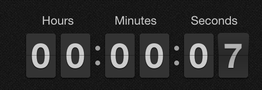

created [angular-flipclock](https://github.com/stevermeister/angular-flipclock "github.com") module - **AngularJS** wrapper for **[FlipClock.js](https://flipclockjs.com/)** jQuery plugin. It's very green for now, so you are welcome to contribute and put suggestions.
