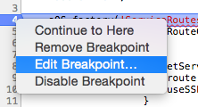
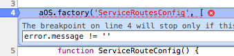
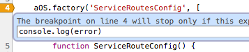

Suddenly found out that Chrome has possibility to "**edit breakpoint**" or other words - to add extra behaviour for it: like stop only for **special condition**, output **console.log**, etc.

It's easy to do by right click on break point:

and after create extra code:

or it could be **console.log**:

 

For more information you could review [this video](https://egghead.io/lessons/angularjs-editing-breakpoints-in-chrome-devtools "egghead.io") from egghead.
