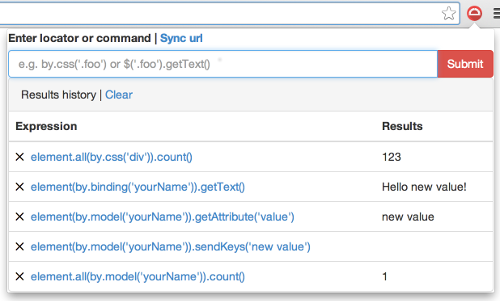
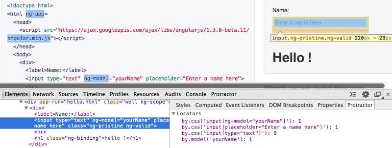
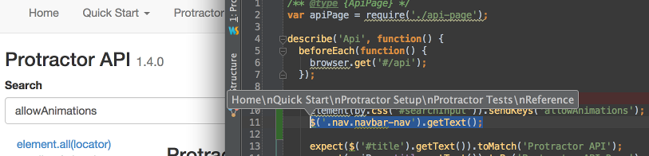

Недавно для себя открыл интересный **npm** модуль **[elementor](https://www.npmjs.com/package/elementor "npmjs.com")**. Крайне странно, что я не слышал о нем ничего от "избранных" мира JS. Он представляет из себя что-то на подобие оболочки для **[Protractor](https://github.com/angular/protractor "angular/protractor")** для удобной работы с локаторами.

Думаю даже ничего рассказывать не нужно все показано в этом 4х минутном ролике:

<iframe src="https://www.youtube.com/embed/kC0JYp79tdo" width="560" height="315" frameborder="0" allowfullscreen="allowfullscreen"></iframe>

Кому лень смотреть 4 минуты (хотя я крайне рекомендую), вот основные моменты:

- Удобное **тестирование локаторов** в браузере:

- Дополнительная вкладка в WebDeveloper Tools, которая показывает **возможные локаторы** для выбранного элемента:

- Плагины для [**WebStorm**](https://github.com/andresdominguez/elementor-idea "github.com") и [**Sublime**](https://github.com/andresdominguez/elementor-sublime "github.com"), которые позволяют сразу **выполнять локаторы** в коде:

## Установка и запуск

Так как это npm модуль, то для установки достаточно выполнить команду:

\[shell\] npm install elementor -g \[/shell\]

А потом чтобы запустить:

\[shell\] elementor https://angularjs.org \[/shell\]

\* При этом конечно у вас уже должны быть установлены **protractor** и запущен **веб-драйвер** ( об этом можно почитать [тут](http://stepansuvorov.com/blog/2014/02/angularjs-protractor/ "Тестируем AngularJS используя Protractor") и [тут](http://stepansuvorov.com/blog/2014/11/protractor/ "Автоматизируем тестирование AngularJS с Protractor")).

 

**UPD**: с новым релизом появилась возможность тестировать сайты без AngularJS, для этого запускаем командой:

\[shell\]elementor https://google.com --nonAngular\[/shell\]
